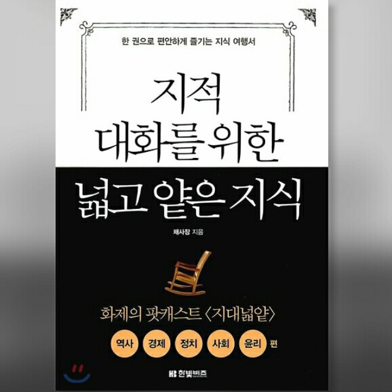

## 저자 : 채사장 / 한빛비즈

## 읽은기간 : 18.12.19 ~ 18.12.29

### 읽은지 좀 되어서 내용자체가 많이 기억은 안나는데 인상 깊었던 부분은

### 자본을 생산하는 수단을 가진자가 되어야 부를 가질수 있다는 부분

### 그리고 아니라고는 하지만 신자유주의가 결국에는 자본가를 위한 나쁜것,

### 복지를 최우선으로 해야 한다는 사상이 책에 전반적으로 깔려있음

### 중립 적인 것처럼 포장하지만 정치적으로 치우쳐져 있다는 인상
