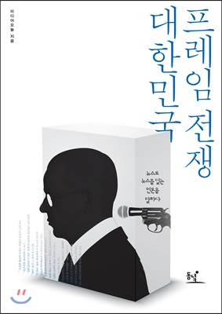

## 저자 : 미디어오늘

## 읽은기간 : 19.01.06 ~ 19.01.10

### 재미있었음

### 김기춘 초원 복집 사건 이야기 부터 시작해서 박근혜 탄핵으로 마무리 하는데
### 현대사를 언론들의 프레임 대결의 관점으로 본다는것이 새로와서 흥미로웠음
### 두고두고 다시 읽어볼 책이라는 생각이 듬

### 알고 있는 사실과 약간 다른부분이 있긴함, 박근혜 탄핵 사건때 조선일보의 행보 등.
