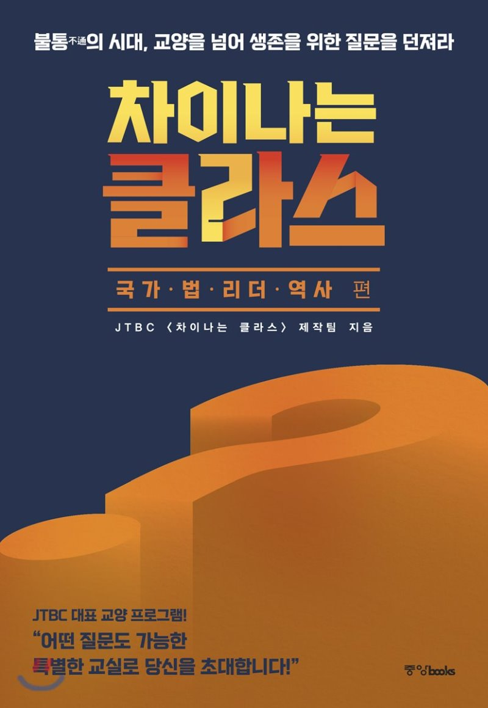

## 저자 : JTBC - 차이나는 클라스 제작팀

## 읽은기간 : 19.01.25 ~ 19.01.28

### 강남 Yes24 중고서점에서 약속 기다리다 사서, 4일 동안 틈틈히 읽었다.

### 차이나는 클라스 TV 프로그램에서 몇몇 강의자가 강의했던 내용을 편집해서 책으로 옮겨놓았다.

### 각자 완전히 다른내용들이 하나의 책으로 엮어졌기때문에 틈틈이 읽어도 내용을 금방 따라 갈수 있었고,

### 편집도 깔끔하여, 편한 마음으로 읽었다.

### 국가 편 - 문정인, 조한혜정, 조영태

### 법 편 - 박준영, 이국운

### 리더 편 - 김준혁, 김종대

### 역사 편 - 한명기, 황석영

### Best :

#### 리더 편 - 김종대 : 왜 지금 이순신인가
#### - 이순신 장군 이야기는 언제 읽어도 흥미롭다, 어떻게 그런 사람이 있을까
#### 역사 편 - 황석영 : 우리는 왜 그날을 잊어서는 안 되는가
#### 역사 편 - 한명기 : 민족에게 역사란 무엇인가
#### - 내가 역시 역사를 좋아하는 모양이다. 위 세편은 전부 시간가는 줄 모르고 읽었다. 책읽으면서 이런느낌 흔하진않은데

### Worst :

#### 국가 편 - 조한 혜정 : 선망하는 국가가 되기 위한 조건은 무엇인가
#### 국가 편  - 문정인 : 한국의 생존 전략은 무엇인가
#### - 조한혜정 편 :  강의하는내용은 거의 공감이 안된다. 온통 자의적인 해석 뿐이었다, 한줄한줄 읽을때마다 반박하고 싶은 내용, 묻고 싶은 내용이 많았다.
#### - 문정인 편 : 중국을 너무도 대단한 국가로 포장하려 하다보니, 무리수를 두는 의견이 좀 보이는것 같았다.
