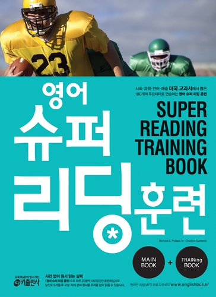

## 저자 : Michael A. Putlack 키 출판사

## 읽은기간 : 19.01.16 ~ 19.02.01

### 지하철에서 출퇴근때마다 꺼내서 읽었다.

### 문장들이 짧게 끊어져 있고, 단어가 어렵지 않아 읽는데 어려움은 크게 없었다.

### 총 170개의 지문으로 구성되어 있다.

### 내용이 재미있는 지문들이 많아서 중간부분의 수학, 미술 파트를 제외하고는 재미있게 읽었다.

### 이런류의 책을 꾸준히 읽다보면 리딩 실력이 늘지 않을까 생각이 든다.
