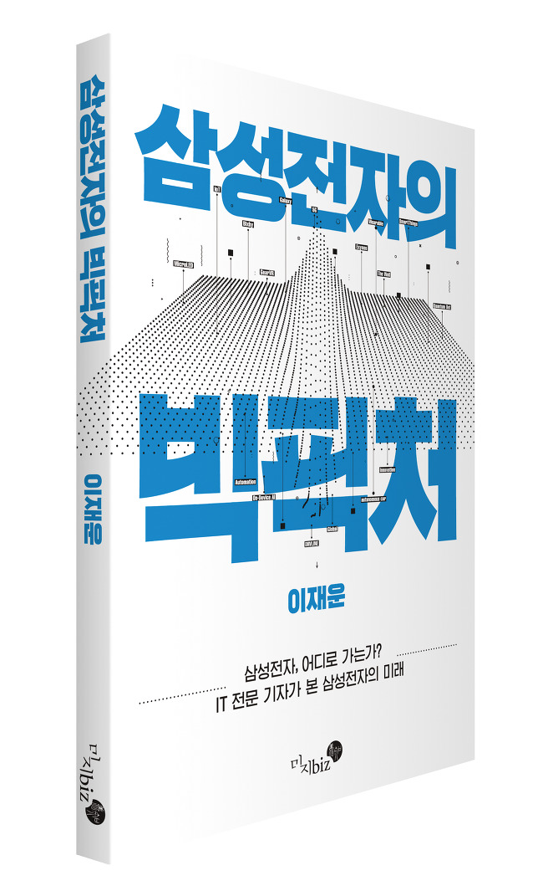

## 저자 : 이재운 , 미지 biz

## 읽은기간 : 19.02.02 ~ 19.02.03

### IT 전문기자 출신이 쓴 삼성전자의 사업현황 및 과거, 미래에 대한 책이다.

### 책 크기가 작고, 페이지가 많지 않아 금방 읽었다.

### 삼성전자가 길지 않은 과거에 어떤 사업을 했고, 어떤 회사를 인수 했으며,

### 현재 어떤 사업 포트폴리오를 갖고 있는지, 어디에 집중을 하고 있는지,

### 가까운 미래에는 어떤 사업을 할것인지에 대한 정보들이 쓰여있다.

### 엄청난 인싸이트가 담겨있지는 않지만, 인터넷에 있는 블로그 글들보다는 자세히 정보가 나와있어 읽어볼만 했다.

