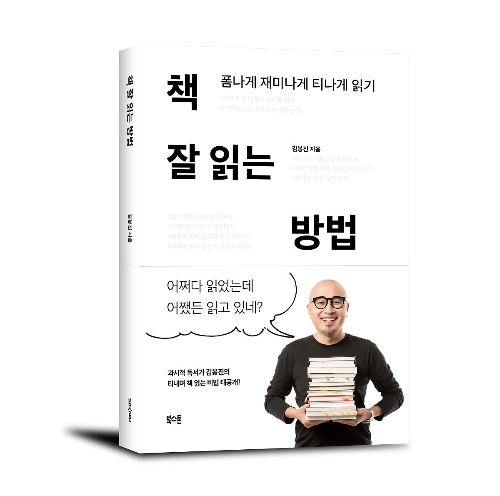

## 저자 : 김봉진 , 북 스톤

## 읽은기간 : 19.02.04 ~ 19.02.05

### 우아한 형제들, 배달의 민족 김봉진 대표가 쓴 책

### 개발자라면 우아한 형제들이라는 회사에 관심이 있을텐데, 나도 역시 그랬다.

### 저자인 김봉진 대표가 어떤 사람인지 알고 싶기도 했고, 책을 잘 읽을 수 있는 방법론에 대해 알고 싶은 마음도 있어서 선택했다.

### 저자가 본인을 칭할때 쓰는 과시적 독서가라는 표현이 재미있다.

### 소소하게 책읽는 방법에 대해 쓰여져 있고, 아 이사람 책을 참 많이 읽는다는 느낌을 받을 만한 내용들 이었다.

### 뒷부분 챕터의 저자가 추천하는 도서들과 추천하는 이유들에 대해 쓰여져 있는 부분은 꽤나 유익했다.

### 읽을 책을 선택할때 도움이 될뿐더러,

### 앞으로 나도 저정도로 남들에게 추천해줄수 있는 역량이 되었으면 좋겠다고 다짐을 하게 만들었다.

