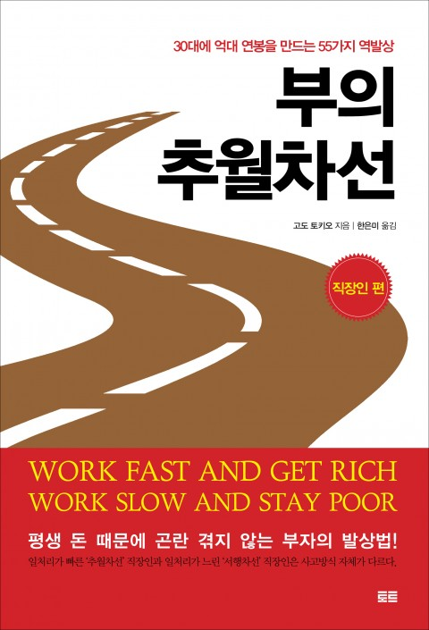

## 저자 : 엠제이 드마코 , 토트

## 읽은기간 : 19.02.08 ~ 19.02.09

### 생각을 깨주는 도끼같은 책이었다. 유익한 내용이 많았다.

### 친구가 강추를 해서 읽게 되었다.

### 부자가 되는 지름길을 알려주겠다는 내용.

### 결국은 읽다보면 사업을 하라는 이야기 이고,

### 돈을 많이 벌어야 하는 이유는 진정한 부를 얻기 위함이며,

### 진정한 부는 가족(사랑하는사람), 신체(건강한몸), 자유(직장을 떠나 마음대로 하고싶은것을 할수 있는 자유) 라는 이야기

### 중반 이후부터는 사업하는 방법에 대한 구체적인 이야기라 약간 흥미가 떨어졌었다.

### 다음 글귀들이 인상 깊었다.

    나의 시간, 시간이 중요하다!

    할부는 쓰지마라, 기생적인 부채가 생긴다!

    당신이 할수 있는 최고의 투자는 당신 자신에 대한 투자다. 교육에 기꺼이 투자해라.

    언젠가라는 말은 절대로 하지 마라 언젠가를 오늘로 만들어라 완벽한 시간이라는것은 없다. 언젠가는 바로 오늘이다. 오늘은 지금이다.
    오늘이야말로 당신이 가진 전부이다. 당신이 언젠가를 기다린다면 기회는 지나가 버린다.

### 하나 생각해 보아야 할점은

### 책에서는 줄곧 "은퇴가 최고", "직업은 노동일뿐이며, 힘들고 고된것 빨리 버려야 하는것" 으로 묘사 한다는 것인데,

### 반면에 직업 그자체에 대해 긍지와 자부심을 가지고 만족감을 느끼며 살아가는 사람도 분명 있을것이란 점이다.

### 그럼에도 불구하고, 얻을 만한 내용은 많이 있었다.

