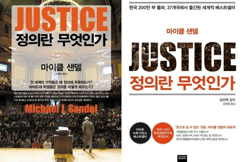

## 저자 : 마이클 샌델 , 와이즈 베리

## 읽은기간 : 19.02.06 ~ 19.02.11

### 설연휴때 와이프와 제주도 여행중, 게스트하우스에서 정의란 무엇인가 구판을 발견하고 반의 반정도 읽다가

### 돌아오기전 신판을 주문해서 집에서 읽었다.

### 뉴스들을 보며 여러 사회이슈들에 대해 생각할때 이게 어떻게 풀어야 될 문제인지 저게 과연 옳은것인지 판단을 어떻게 내려야 할지

### 혼란 스러울때가 많아 이책을 읽어보면 도움이 될까 생각하며 책을 집어 들었었다.

### 책에서는 구제금융,모병제,대리모 임신, 동성결혼, 이민법, 노예제 보상 문제등 여러 일화들을 소개하며

### 각 이슈에서 과연 정의란 무엇인지에 대해 묻고, 이를 통해 사회를 움직이는 원칙과 정의 법을 정하는것은 굉장히 어렵다는것을 깨닫게 해준다.

### 그러면 어떤 기준과 철학을 토대로 판단을 내릴것이냐?, 그판단의 도덕적 근거가 무엇이냐?

### 벤담, 존스튜어트 밀의 공리주의, 칸트의 이성, 존롤스의 차등원칙 , 아리스토텔레스의 목적론 등이 책에서 소개된다.

### 책은 모든 철학이 장점, 단점이 있어서 무엇이 무조건 옳다고 할수 없다는것을 알려준다.

### 그러면 어떻게 옳은 판단을 내릴것이냐? 과연 정의란 무엇이냐? 상대적인것이냐 절대적인것이냐?

### 저자는 마지막에 본인의 생각을 밝힌다.

### 앞에서 늘어놓은 여러 뛰어난 철학자들의 철학도 단점, 허점이 있고 사회의 모든 이슈를 커버할수 없으니

### 즉 다시 말하면 어떤 철학에 의한 절대적인 도덕기준을 정해서 "이것이 절대적 진리이며 정의이므로 따르라" 할수 없으니,

### 각자 개인이 높은 시민의식을 연마하여, 정치에 적극적으로 참여하여 문제를 해결하라는 결론이다.

### 각 사회 이슈마다, 심지어 개인의 종교, 도덕적 신념까지도 피하지 않고, 깊숙히 성역없이 끊임없이 토론하고, 논쟁하고, 배우고, 합의하여

### 정의로운 사회를 만들자는 이야기이다.

but 근미래에는 엄청난 지적수준을 갖춘 AI가 나타나서, 정의가 무엇인지 명확하게 알려줄수도 있지않을까라는 생각은 한번 해보았다.

## 아쉬웠던점
### 1. 번역이 매끄럽지 못하다
잘안쓰는 표현들을 조합해서 번역해놓으니 가뜩이나 내용도 어려운 철학,윤리를 말하는데, 무슨말인지 모를때가 많다. 수능 국어 독해 지문같이 느껴진다.

### 2. 내용이 어렵다
내용이 어려웠다. 초반과 마지막부분은 읽을만했지만 중간의 여러 철학들을 소개하고 깊게 파고 들때는 힘들었다.

## 인상깊었던 대목중 하나 -  롤스가 능력주의 시각을 비판하는 글
 롤스는 성공으로 향하는 길에 놓인 사회적, 경제적 장벽만 제거하면 누구나 재능이 선사하는 포상을 받을 자격이 있다는 능력주의 사회의
 기본전제에 의문을 제기하며 능력주의 시각을 비판한다.

 우리는 초기 사회적 출발선을 당연하게 받아들일 자격이 없듯이, 선천적으로 배분된 재능 역시 당연하게 받아들일 수 없다.
 타고난 능력을 발전시키는 훌륭한 성격조차 당연히 자신의 공이라는 생각은 문제가 있다. 그러한 성격 형성에는 우리 노력의 결과라고 할 수 없는,
 어린 시절의 좋은 가정과 사회 환경이 크게 영향을 미치기 때문이다. 자격이라는 개념은 여기에 적용되지 않는다.
