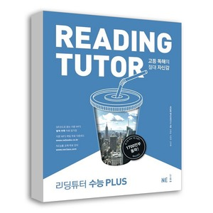

## 저자 :  NE능률 영어교육연구소 , NE능률(능률교육)

## 읽은기간 : 19.02.11 ~ 19.02.18

### 출퇴근용으로 사서 읽었다.

### 슈퍼리딩훈련하고 비슷하게 다양한 주제의 짧은 지문으로 엮여져 있다.

### 분량 자체는 많지 않았다.

### 해석도 분리되어 있어서 보기 어렵고, 편집이 슈퍼리딩훈련보다는 많이 아쉽다.

### 내용은 약간 더 어려운 수준, 못읽을 정도는 아니다.
