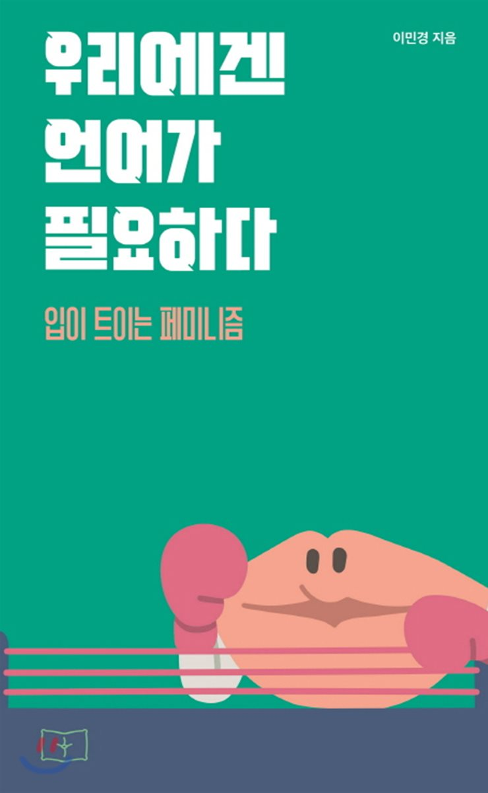

## 저자 :  이민경 , 봄알람

## 읽은기간 : 19.02.13 ~ 19.02.18

### 와이프가 추천해서 읽은책, 와이프는 아직 안읽었다.

### 페미니즘에 대한 주제로 상대방(주로 자기할말만 하거나, 반박만 하려고 하는) 과 토론하는 방법에 대해 설명되어있는 글이다.

### 독자가 차별을 많이 겪어보고, 페미니즘에 대해 많은것을 알고 있는 여성이라는 것을 전제로 하고 있기 때문에 페미니즘 자체에 대한 설명은 없다.

### 명확하게 이해하기 어려운 내용도 있었다. ex : 책에서 의미하는 가부장제라는것의 의미가 정확하게 무엇을 말하는것인지..등

### 상당히 공격적인 어투로 적혀있기때문에, 반감을 불러 일으킬수 있지만, 오죽했으면 이렇게 썼을까 하면서

### 이해하려 노력하며 읽었다.

### 내가 몰랐던 여성들이 느끼는 감정들, 개념없는 남성들때문에 겪었던 위협적인 사건들,

### 음흉한 행동을 하는 남성들, 이야기를 들어주는 척하지만 사실은 말싸움을 이기려 들려고만 하는 사람들,

### 아예 아무관심도 없고 뻘소리만 하는 사람들에 대한 이야기들을 보며

### 나도 여태껏 이런문제에 대해 무심했고, 개념없는 행동을 무의식적으로 하지 않았을까 생각해보게 되었다.

### 책의 결론은 여성운동도 마찬가지로 저항하지 않으면 얻어지는것은 없다. 잘 못하겠으면 내가 알려주는대로 강하게 행동하자 인것 같다.

### 앞으로 페미니즘에 대한 다른 책도 읽어보려 한다.

