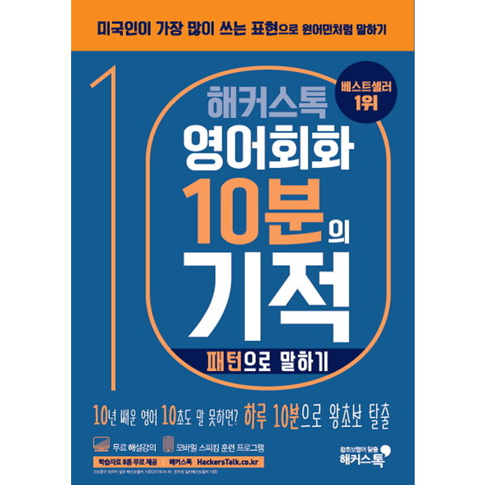

## 저자 :  해커스 어학 연구소

## 읽은기간 : 19. 02. 26 ~ 19. 03. 02

### 100가지의 말하기 패턴들을 유형별로 예문과 함께 적어놓은 책이다.

### 실제로 내가 쓸수 있을것 같은 표현은 3분의 1정도 되는것 같다. 나머지는 잘모르겠다.

### 어쨌든 열심히 외워 놓으면 나중에 도움이 되겠지

### 분량이 많지 않으니 계속 훑어 보듯 보다보면 좋을것 같다.

### 더 쉬운 기초패턴 책도 구매 계획중이다.
