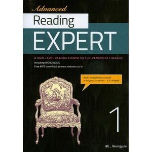

## 저자 :  NE능률(능률교육)

## 읽은기간 : 19. 02. 21 ~ 19. 03. 05

### 출퇴근용

### 전에 읽던 리딩 튜터 수능 PLUS 보다 난이도가 급상승했다.

### 모르는 단어도 꽤 많이 나오고, 문장구조도 어려워서 정신 안차리면 뭔말인지 못따라갈때가 많았다.

### 이거 말고도 같은 제목의 책 2편을 하나 더 샀었는데,

### 방금 목차를 보니 그 책은 고등학생 용이고 이책은 토플, 텝스 보는 사람 용인것 같다.

### 지문이 어렵고, 길긴하지만 책 분량자체가 두꺼운편은 아니라 어쨌든 다 읽었다.

### 내용이나 구성 자체는 만족스러웠다. 나중에 다시 꺼내 읽어야겠다.
