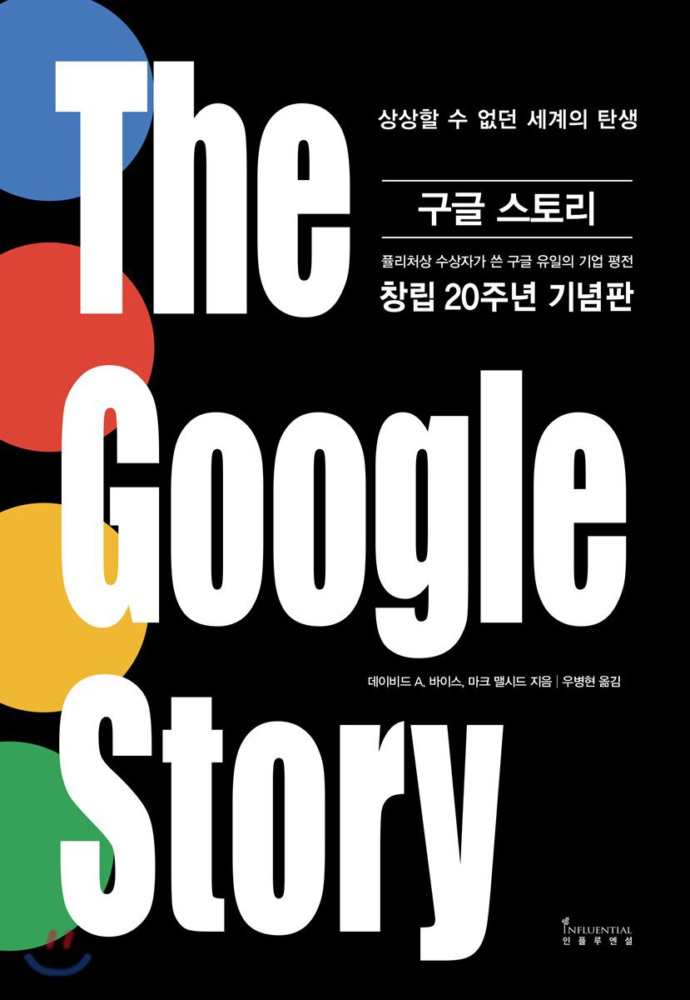

## 저자 : 데이비드 A. 바이스 / 인플루엔셜

## 읽은기간 : 19. 02. 12 ~ 19. 04. 07

### 세르게이 브린, 래리 페이지가 1998년 구글을 창업하면서 부터

### 에릭슈미트를 만나고, IPO 이후 2000년대 초중반까지의 이야기를

### 자세하게 다룬 책이다.

### 그들에게 어떠한 고난과 역경이 있었는지, 누구에게 도움을 받았고, 어떻게 위기를 극복했는지 나와있다.

### 초반 투자 받을때의 이야기들, 중반 마이크로소프트와의 소송과 대결,

### 마지막 우버와의 소송등이 인상깊었다.

### 2000년대 중반이후 구글이 더 크게 성장해나간 이야기들 : 안드로이드, 알파고 등의 이야기를 다루지 않은것은 조금 아쉽다.

### 아마 책 자체가 초판이 그 시기에 나오고 계속 조금씩 업데이트했기때문에 다루지 못한 느낌이다.

### 기술적인 내용보다는 주로 경영쪽의 이야기가 많아서,

### 생각했던것과는 약간 달라서 실망스러운 부분도 있었다.

### 나름 나쁘지 않게 읽었다. 구글의 태동, 성장한 역사에 대해 알수 있었다.

