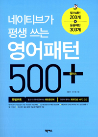

## 저자 : 이광수,이수경 / 넥서스

## 읽은기간 : 19. 04. 10 ~ 19. 04. 13

### 200가지 영어 말하기 패턴이 등장하는 책.

### 내용은 어렵지 않음.

### 우선순위 기본 패턴 / 의문사 활용 패턴 / 상황별 필수 패턴 / 네이티브 식 리얼 패턴 순으로 정리 되어있다.

### 이것보다 심화 과정 책이 한권 있는것으로 알고 있다.

### 새벽달 유튜브 채널 보다가 추천하길래 샀었는데, 내용은 나쁘지 않은것 같다 예문도 꽤 적혀 있고.

### 이미 아는 표현이 절반이상은 되는듯하다. 실제 말할때 사용을 못해서 문제지..

### 이제 패턴책은 당분간 그만 사도 될것 같다.

