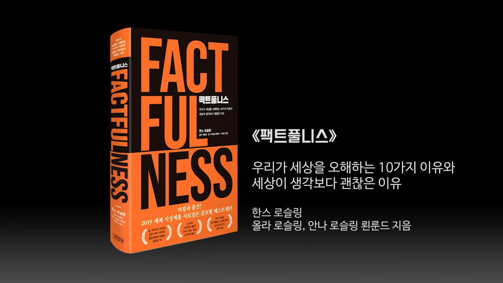

## 저자 : 한스 로슬링 / 김영사

## 읽은기간 : 19. 05. 06 ~ 19. 05. 10

### You know nothing. 침팬지 보다 못한 나의 상식!

### 김봉진 대표가 이책을 추천한 것을 보고 사서 읽었다.

### 시간이 아깝지 않았다. 주변에 적극 추천할만한 책이라 생각된다.

### 시작 하자마자 몇가지 질문을 통해,

### 세상에 대해 얼마나 많은 편견을 가지고 있고 오해를 하고 있는지,

### 세계가 지금 어떤 상태에 있는지를 알려주고 , 편견과 오해가 어째서 생겼는지

### 그것을 어떻게 극복할수 있는지를 꽤 합리적으로 설명해주는 책이다.

### 팩트풀니스 - 사실 충실성에 기반하여 생각하는 방법

### 여러 통계들을 통해 세상이 점점 나아지고 있다는것,

### 앞으로 전세계의 경제 사회적 주도권이 어디로 옮겨질지를 설명한다.

### 인상깊었던 내용중 하나는 전세계 사람들의 생활 방식이 그들만의 문화나 종교가 아닌 소득에 따라 결정되고,

### 같은 소득 수준의 가정이면 전세계 어디서나 비슷한 생활방식을 갖고 있다는 사실이었다.

### 추천평대로 이책을 읽고 나면 그동안의 세계관이 완전히 뒤바뀐다. 적극 추천하는 바이다.

## 참고 : 전세계 가정들의 생활 패턴을 소득을 기준으로 줄을 세워놓은 사이트

## Dollar Street : https://www.gapminder.org/dollar-street/matrix
