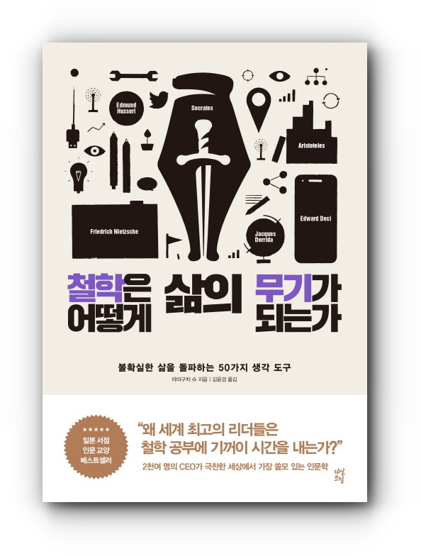

## 저자 : 야마구치 슈 / 다산북스

## 읽은기간 : 19. 05. 12 ~ 19. 05. 27

### 여러 철학자들의 철학을 회사 생활에 맞게 적용할수 있도록 짧게 50가지를 소개 한 글.

### 타인의 시기심을 관찰하면 비즈니스 기회가 보인다 - 니체의 르상티망에 대한 이야기

### 우리는 모두 가면을 쓰고 살아간다 - 카를 구스타프 융의 페르소나에 대한 이야기

### 성과급으로 혁신을 유도할수 없다는 - 에드워드 데시에 대한 이야기

### 노력하면 구원 받을 수 있다고 신은 말하지 않았다 - 장 칼뱅의 예정설

### 진보는 나선형 발전으로 이루어진다 - 헤겔의 변증법

### 조급해 하지마라, 세상은 그렇게 갑자기 바뀌지 않는다 - 토머스 쿤의 페러다임 전환

### 이분법을 넘어서라 - 자크 데리다의 탈구축

### 미래를 예측하는 최선의 방법은 미래를 창조하는것이다 - 엘런 케이의 미래 예측

### 사람은 뇌뿐만 아니라 몸으로도 생각한다 - 안토니오 다마지오의 신체적 표지

### 악의가 없어도 누구나 악인이 될수 있다 / 자아 실현을 이룬 사람일수록 인맥이 넓지 않다 / 개인의 양심은 아무런 힘이 없다

### 재빨리 도망칠 줄 아는 사람이 승리한다 / 공평한 사회일수록 차별에 의한 상처가 깊다 / 보이지 않는 노력도 언젠가는 보상받는 다는 거짓말

### 등의 이야기들이 흥미로웠다.

### 사실 철학관련 내용 자체는 흥미롭긴 했지만

### 같이 엮어서 이야기 하는 부분이 일본인의 국가,경제, 회사생활에 대한 이야기들인지라 딱히 잘 공감이 되지는 않았다.

### 그리고 하나의 글이 2~4페이지분량으로 짧기때문에 해당 글의 핵심 철학을 정말 맛만 보여주는 느낌이었다.
