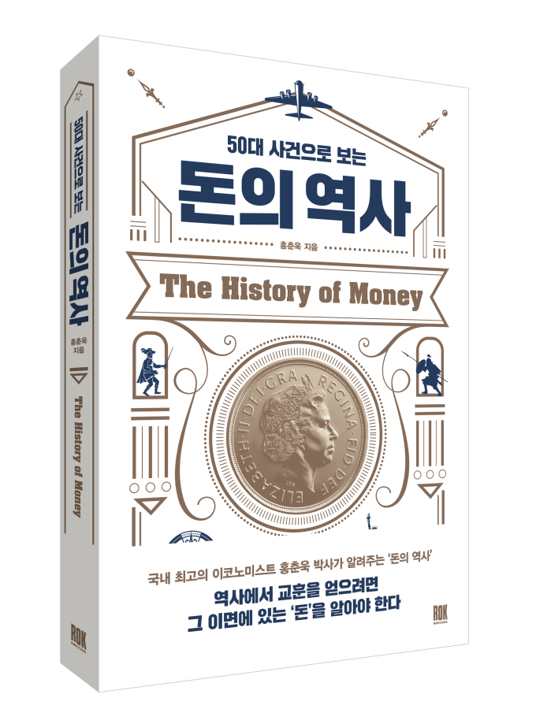

## 저자 : 홍춘욱 / 로크미디어

## 읽은기간 : 19. 05. 29 ~ 19. 06. 06

### 세계 역사를 바꾼 여러 중요한 사건속에서 돈이라는 존재가 어떠한 영향을 미쳤는지가 주된 내용이다.

### 경제와 역사를 결합해 이야기를 풀어나가는데, 개인적으로 최근 읽은 책중 가장 재밌게 읽었다.

### 50가지 사건을 소개하는건 아니고, 총 7부로 7가지 굵직한 이야기를 소개한다.

### 1부는 나폴레옹 전쟁을 중심으로 유럽의 산업혁명과 발전을 살펴보며, 중앙은행의 설립과 금융시스템의 발전을 소개한다.

### 2부는 중국을 중심으로 한 특시 명나라때의 역사와 경제 등

### 3부는 산업혁명의 발생과 확산, 인구압이라는 개념을 설명

### 4부는 1차 세계대전 및 1929 미국발 대공항에 대해, 5부는 1971년 닉슨 쇼크 금본위제 폐기

### 6부는 1985년 플라자합의 이후의 일본 버블경제의 붕괴, 7부는 우리나라의 광복후 토지개혁 및 경제 성장, 외환위기를 다룬다.

### 중간 중간 2008년 글로벌 금융위기에 대한 이야기도 짤막하게 나온다.

### 세상 살면서 생기는 문제중 십중팔구는 돈으로 해결 가능하다는데,

### 전쟁 마저도 죄다 돈때문에 이기고 지고 하는것을 보니 맞는 말인가부다.

### 거시경제쪽 지식이 많이 없다보니, 한번에 잘 이해가 안되는 부분이 있긴 했지만,

### 일단 외국번역 책이 아니기도 하고, 작가분이 이야기를 워낙 쉽게 잘쓰는것 같다. 글 자체는 쉽게 잘 읽힌다.

### 챕터가 끝날때마다 참고용 서적도 소개하는데, 더 깊게 알고 싶으면 해당 서적을 찾아서 읽으면 될것 같다.

