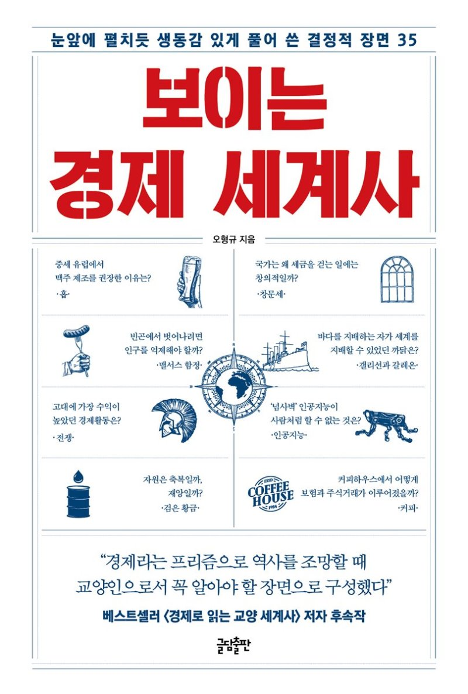

## 저자 : 오형규 / 글담출판

## 읽은기간 : 19. 06. 24 ~ 19. 07. 27

### 세계사에 영향을 미친 경제와 관련된 사건들을 작가의 풍부한 배경 지식을 바탕으로 읽기 쉽게 쓰여진 책이다.

### 음식/전쟁/상업무역/법/문화/자원이 돈과 엮여서 어떤일들이 있었는지, 35가지의 에피소드로 나누어져 쓰여있다.

### 17~18세기 런던의 커피하우스에서 보험과 주식거래가 활성화된 이야기, 독일에서 1516년 반포된 맥주 순수령 등에 대한 이야기가 기억에 남는다.

### 19세기에 어마어마한 부를 거머쥔 로스차일드 가문에 대한 이야기도 인상 깊었다.

### 각 에피소드들이 재미있고 길지 않고 쉽게 쓰여져 있기 때문에, 부담없이 읽을수 있는 책이었다.
