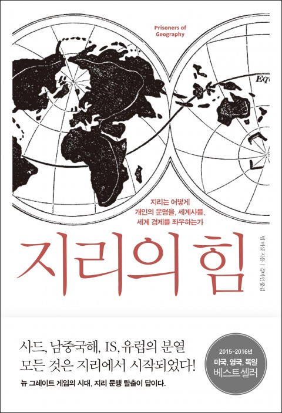

## 저자 : 팀 마샬 / 사이
## 원제 : Prisoners of Geography

## 읽은기간 : 19. 07. 28 ~ 19. 08. 08

### 중국/미국/서유럽/러시아/한국/일본/라틴아메리카/아프리카/중동/인도/파키스탄/북극 순으로

### 각 지역들의 지리적 특성과 그로인해 인해 만들어진 역사와 주변국과의 관계들을 설명해주는 내용이다.

### 해당 나라의 주변국들과의 복잡한 관계들이 그동안 몰랐던 내용도 많고 흥미로웠다.

### 한국에 대한 챕터에서는 한반도 문제에 대해 한마디로 답이 없다라는 식으로 쓰여져 있다.

### 해결책은 없고 현재 상태를 관리만 하고 있다 라고 말한다. (책이 쓰여진 시기가 2015~16년 정도 인것을 감안하기는 해야 할듯)

### 중국은 절대 통일한국을 바라지 않는다. 통일이 되면 코앞에 미군이 주둔하는 상황을 좌시 하지 않을 것이다.

### 미국 역시 한반도에 전쟁이 발생하면, 남한을 위해 싸워줄 생각은 털끝만치도 없지만 우방을 저버리는 일을 할수는 없기에 마지 못해 나설것이라 주장한다.

### 그동안 자세히 알지 못했던 중동/아프리카/라틴아메리카 쪽의 주변정세에 대한 내용도 상당히 유익했다.

### 해당 지역들에서도 중국의 영향력이 상당한것으로 보인다.

### 전세계적으로 영향력을 넓히고 있는 중국의 위세에 대해서도 새삼 다시 알게 되었다.

