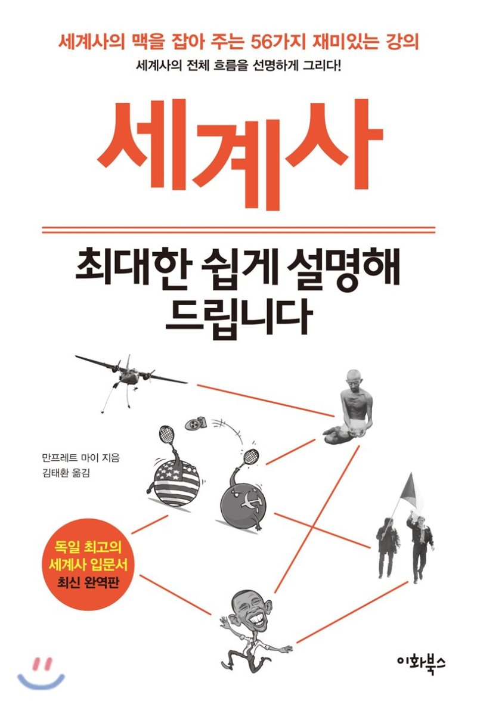

## 저자 : 만프레트 마이 / 이화북스

## 읽은기간 : 19. 08. 14 ~ 19. 08. 30

### 독일 사람이 쓴 세계사 책이다.

### 먼 훗날 은퇴하면 세계사를 깊게 공부하고픈 꿈&계획이 있는데,

### 욕구가 앞 당겨진건지, 요새 그쪽 책을 여럿 보고 있다.

### 이런 종류의 책들은 읽을때 마다 여행에 빠져드는 기분이라 나름의 중독성이 있다.

### 구석기 시대부터 현대에 이르기까지 세계사의 굵직한 사건 56가지를 최대한 쉽게 썼다.

### 읽기가 매우 편한게 장점이다. 세계사 전체의 맥락을 가볍게 익힐수 있다.

### 유럽사람이 쓴책이라 유럽중심으로 적혀져 있긴 하다. 교과서도 그렇고 대부분의 세계사 책이 주로 유럽의 역사를 다루었던것 처럼..

### 아무 부담없이 짬날때마다 중간중간 읽었다.

### 작정하고 편하게 읽을수 있도록 썼기 때문에, 깊은 내용을 알기는 어렵다.

### but 인터넷 시대 아닌가. 읽다가 더 알고 싶은 내용은 검색해서 찾아보면 되니 개인적으로 나쁘지 않았다.

### 이제 곧 가을이 오는구나..시간 참 빨리간다.
