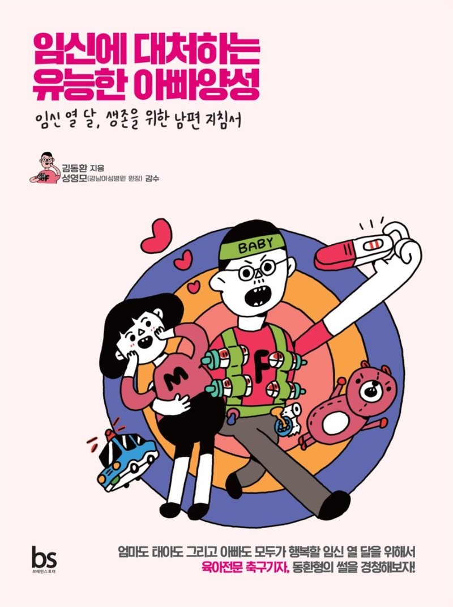

## 저자 : 김동환 / 브레인스토어

## 읽은기간 : 19. 09. 02 ~ 19. 09. 08

### 임신 기간 열달동안, 임산부가 아닌, 예비 아빠들이 어떻게 대처해야 하는지를 적어놓은 책이다.

### 임신에 대해 문외한인 나같은 사람을 주 독자로 삼아 정보를 전해 준다.

### 임신이전, 첫4주~12주, 13주~28주, 29~40주, 그이후 등으로 나누어서 어떻게 행동해야 하는지 행동 지침들이 매우 유용했다.

### 두번 세번 읽어봐야겠다.

### 요새 계속 느끼는건데, 출산 이라는것은 어느 가정이나 대부분 겪지만 각자 전부 특별하고 위대한 일 인것 같다.

### 앞으로 어떤 일들이 있을지 기대반 걱정반..
