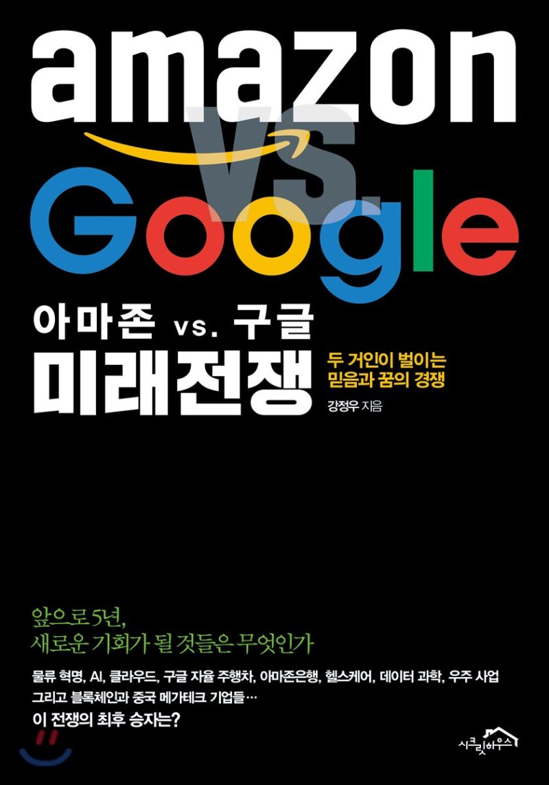

## 저자 : 강정우 / 시크릿 하우스

## 읽은기간 : 19. 09. 09 ~ 19. 09. 14

### 회사 CEO 추천도서라 읽어보았다.

### 아마존과 구글의 IT 비즈니스 경쟁에 대해 사업적인 관점에서 부문별로 논하고 있다.

### 저자의 IT 부문에 대한 식견의 깊이와 통찰력이 놀랍다.

### 인터넷 기사나 블로그에서 볼만한 내용과는 다른, 돈주고 사볼만한 내용이다 싶었다.

### 외국 번역 서적이 아니기때문에, 번역 문제도 없어서 편하게 읽었다.

### 두 공룡 회사가 AI, 로봇, 빅데이터, 헬스 케어, 우주 탐사, 핀테크 부분에서

### 각각 어떤 전략으로 사업을 진행하고 있는지 현황 및 그들의 철학에 대해 알수 있게 되었다.

### 출판된지 얼마 안되었기 때문에 (19년 5월), 거의 최신 내용을 알수 있다.

### IT인 이라면 강력추천.
