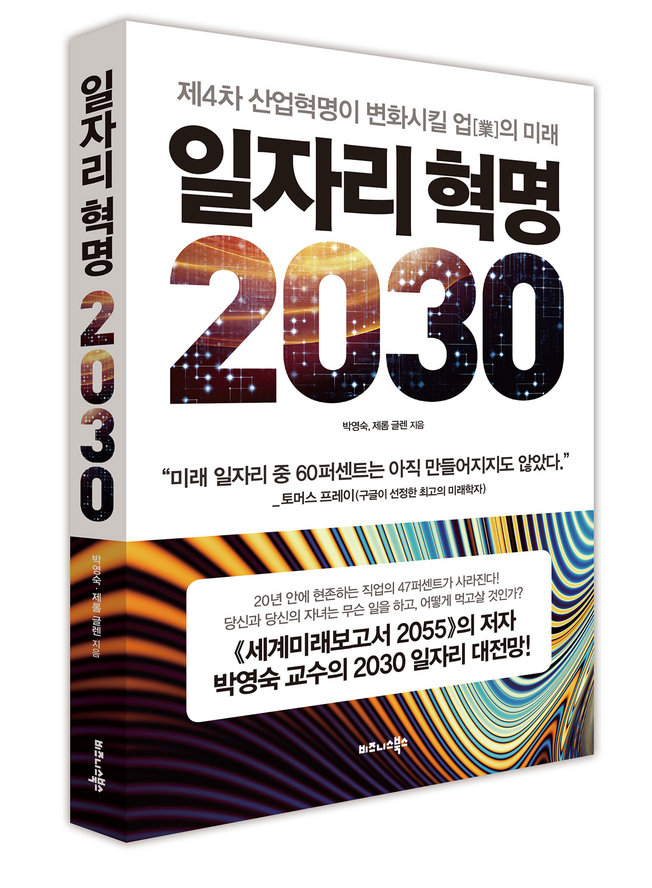

## 저자 : 박영숙, 제롬 글렌 / 비즈니스 북스

## 읽은기간 : 19. 09. 17 ~ 19. 09. 22

### 회사 CEO 추천도서라 읽어보았다.

### 앞으로 근미래,먼미래에 사라질 일자리, 새로 창조될 일자리 분야(태양광, 로봇, 무인자동차, AI, 디지털 통화, 증강현실, 생명공학,  보안 등등) 등을 이야기 하고,

### 사회가 어떻게 변화할것이며, 우리는 어떻게 대처해야 되는지를 알려주는 내용이다.

### 원래 미래학자들의 스탠스가 그런것인지, 일단 저자의 미래에 대한 태도가 굉장히 낙관적이다.

### 인구절벽/고령화/자동화된 사회가 되므로, 나라에서 모든 국민들에게 보편적 기본소득을 지급하는 시대가 온다고 예측한다.

### 책이 쓰여진 2017년을 기준으로 20~30년후 인류는 계속 번영하고 AI 및 무인자동차, 자동화등으로 인해 공산품가격은 점점 다운되어, 생활비는 줄어들고,

### 공유경제로 패러다임이 변화하므로 소유의 개념도 달라지고,

### 따라서 기본소득으로 인해 일안해도 먹고 살수 있을 정도이며,

### 무인자동차가 생겨서 차의 소유의 개념은 사라지며, 따라서 주차장도 사라지고, 도로 상황도 쾌적해지고, 환경공해도 줄어들고, 교통사고도 사라지고, 운송비용이 획기적으로 줄어든다.

### 디지털 암호화폐가 기존 금융시장을 붕괴시키고, 앞으로 30년안에 주식시장도 사라진다. "코인경제" 라는 용어가 생긴다.

### 따라서 IPO도 사라지고, 인구 절벽때문에 부동산 가격도 뚝 떨어질것이기 때문에 투자할곳은 오로지 ICO만 남는다.

### 10년이내에 이쪽분야에 굉장한 일자리가 창출될것이다.

### 조선, 해양 산업도 붕괴될것이다. 그러므로 우리나라도 대비 해야 한다고 한다.

### 저자는 이 책을 쓰는 시점에서 (16~17년인듯) 대우조선에 대한 3조 지원을 중단해야 한다 하였다.

### 이미 영국은 이러한 조선,해양산업의 붕괴를 예견하고 1970년대부터 사양사업으로 지정하고 지원하지 않았다고 한다.

### 인터넷과 와이파이로 연결된 세상에서는 2~3개월씩 바다에서 물건을 싣고 날라봐야 이득이 크지 않는다 한다.

### 초고속으로 비행하는 비행기와 무인비행기, 하이퍼루프, 3D 프린터가 또한 대체할것이다.

### 등등..

### 개인적으로는 공감가는 부분도 있지만, 많은 부분이 허무맹랑 하게 느껴졌다.

### 근거는 부족하고 논리의 비약이 좀 중간중간 거슬린다.

### 사회 전분야를 하나하나 깊게 이해하며 예측하는것 같진 않다. 한마디로 약장사가 약팔듯 하는 느낌이 들었다.

### 요새 소위 유행하는 말인 불안장사꾼 이지 않나 싶을 정도..

### 허무맹랑하다 느낀 부분 몇가지를 디벼보자면..

### 1. 조선, 해양산업은 관련부분이 혁신을 하면 했지, 아예 없어져서 붕괴하지 않을것 같다.

### 2. 코인 경제라는게 근미래에 기존 경제 체제를 뒤엎을것같지 않다.

### 3. 태양광 산업이 2020년부터 에너지의 주력으로 활성화 되기 시작하고,

### 2030년이 되면 현재 한전 직원보다 10배의 사람들이 태양광 산업에 종사하며 한전의 전기 독점 시대가 끝날것 이라 한다.

### 올해 2019년이 다 끝나가는데, 당장 내년에 주력이 된다고??..태양광에서 나오는 에너지가 다른 에너지들보다 경제적으로 싸다고?

### 4. 또한 기존의 50년은 컴퓨터의 시대였고, 향후 50년동안은 생명공학이 우리 삶을 지배하게 될것이므로,

### 아이들에게 컴퓨터로 하는 코딩보다는 생물학 코딩을 가르쳐야 한다고 하는데, 개발자 입장에서는 무슨말인지 감도 안온다.

### DNA나 유전적 형질을 재배치하는것을 코딩이라고 표현하는것 같은데,

### 이런게 컴퓨터로 하는 코딩과 같은 수준에서 이야기 할수 있는것인지,

### 집에서 마음대로 이런 것을 컴퓨터 코딩하듯 할수 있는/해도되는 시대가 올것인가? (윤리적인 부분이나, 기술적인 부분에서).. 의심스럽다.

### 5. 공유경제가 이책에서 말하는 대로 20년쯤 후면 사회의 전분야로 확대될까?

### 과연 사람들이 집도 없고 차도 없고, 아무것도 가지지 않고 대부분 대여하는 무소유에 가까운 삶을 살게 될까?

### 인간의 소유욕에 대한 더 깊은 연구나 관련 근거가 필요하지 않을까?

### 그리고 이책의 뒷부분은 주로 디지털시대 리더(아마 타겟은 기업 CEO들인듯)들을 위한 미래 예측 가이드라 해서

### 인도,중국의 산업 예측, 자동화를 받아들이는 자세, 인구학적 측면에서의 미래 예측, 기업의 디지털 비즈니스 전략에 대해 논하는데,

### 무슨 말을 하려는건지 잘 이해가 안된다. 이쪽은 더더욱 근거나 배경설명없이 자기 주장을 하는 느낌이다. 따로 해설이 필요한 수준이다.

### .. 얻어 갈만한 내용은 책의 두께에 비해 얼마 안되는 느낌.. 부실한 부분은 대충 분량 늘리려고 적은듯..
