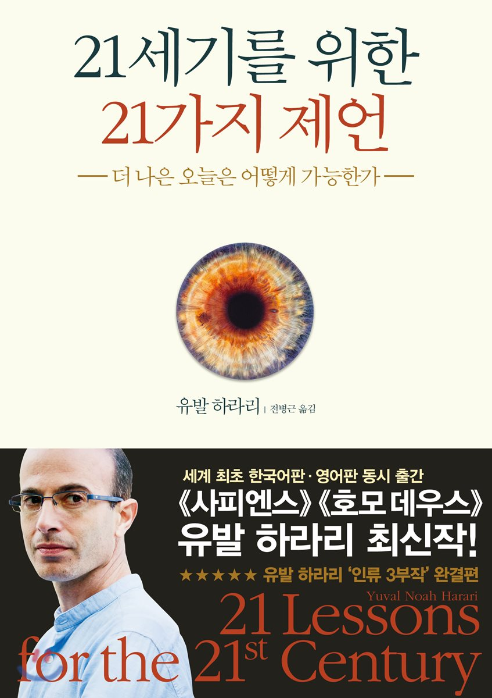

## 저자 : 유발 하라리 / 김영사

## 읽은기간 : 19. 09. 24  ~ 19. 09. 28

### 사피엔스, 호모데우스를 쓴 그 유명한 유발 하라리의 책이다.

### 빌게이츠 형님이 유튜브에서 강력 추천하길래,

### 이 책하고, 제러드 다이아몬드의 대변동 위기 선택 변화를 일단 샀다.

### 500페이지가 넘기때문에

### 경험상 한번 끊어지면 오래 걸릴것 같아서 5일동안 의식적으로 빠르게 열심히 읽었다.

### 내용 자체는 되짚어보면 이해하기 쉬운 내용은 아니었지만,

### 번역이 나름 잘되어있고, 글 자체도 깔끔하게 써져있어서 이해한듯 술술 넘어갔다.

### 미래가 어떻게 될지를 예측하며, 현재를 바라보고, 앞으로 어떻게 대처해야 될지를

### 높은 수준의 역사적 지식과, 철학, 통찰력을 이용하여 본인의 생각을 적어놨다.

### (누구나 예측하듯) AI, 데이터, 생명공학의 시대가 온다 하였고,

### 세상은 엄청나게 변화하므로 아무도 정확히 예측할수는 없다 하였다.

### 이렇게 미래를 예측하기 어려운 시기는 그동안 역사적으로도 없다 하였다.

### 생활/정치/철학/경제/국가 등 모든게 획기적으로 달라질거라 보았다.

### 생명공학은 진보할것이지만 가진자와 못가진자의 차이로 인해

### 그 혜택을 볼수 있는 사람과 아닌 사람으로 구분되어

### 새로운 인종이 나타나 기존 호모사피엔스와 갈등이 일어날수도 있을거라 본다.

### 또한 핵무기, 기후변화, 진보된 기술의 오남용 등으로 인해 세계가 위기가 올수 있다 하였다.

### 이러한 문제는 한 국가 차원에서 해결할수 없으므로, 전세계가 합심을 해야 그나마 위험을 줄일수 있을것 이라 하였다.

### 그러나 전세계를 하나로 묶기에는 얽히고 섥힌 이슈들이 많아 쉽지 않을것이라 보았다.

### 책 전반에서 민족주의 ( or 파시즘), 종교의 해악과 모순을 줄기차게 이야기 한다.

### 남 이야기보다는 본인을 케이스로 놓고 까는게 공평할거라면서

### (본인이 이스라엘 사람이므로) 대부분 이스라엘 유대교 및 이스라엘인들의 민족주의를 비판하고 있다.

### 굉장히 혐오하는듯..

### 책의 후반부에서는 인생의 의미를 찾는 방법에 대해 나름의 철학을 이야기 한다.

### 인생에 답은 없다. 인생의 의미를 종교나 신화나 철학, 역사, 민족 같은 이야기에서 찾아봐야 다 날조된 거짓이므로 소용없다.

### 또한 너의 자유의지를 가지고, 너의 마음안의 목소리를 따라가라 라는 가르침 또한 소용없다라고 말한다.

### 진정한 의미의 자유의지는 없기때문이다.

### 자유의지로 착각할뿐 결국 뇌의 수많은 뉴련들의 화학작용은 250만년동안 호모사피엔스에게 각인된 본능, 욕구, 욕망과

### 자라면서 알게모르게 주입된 사회적/문화적 편견등으로 이루어진것일 뿐이기 때문이다.

### (... 그러면 뭘 어쩌란 말이냐!)

### 유발 하라리 형님은 말한다.

### 답은 명상이다!

### 명상을 하며 너의 의식을 너의 정신에 깊이 접속하여 스스로를 관찰하라 라고 말한다.

### 모든 감정과 욕구과 고통은 나자신의 정신 패턴이며 감각일 뿐이라고 한다.

### 그러면서 불교 이야기도 좀 한다. 인생은 이야기가 아니며 아무것도 중요하지 않고 본인의 감각을 관찰하고 느껴보는것이 중요하다 라는 식으로 이야기 한다.

### 마지막 장에 명상이 나올때는 사실 좀 당황스럽긴 했다. 답이 명상이라니!

### 명상은 내가 안해봐서 잘 모르므로 일단 20장까지만 알아 들은셈 쳐야 겠다.

### 이렇게 강력 추천을 하는것을 보니 언젠간 기회가 되면 명상을 해보고 싶긴 하다.

### 전체적으로 전혀 돈이 아깝지 않은 양서 였다. 여기에 쓴 이야기들 말고도 다른 주제의 이야기들(이민,교육,테러리즘,전쟁,겸손,가짜뉴스,SF소설 등등)도 많이 적혀져 있다.

### 유발 하라리의 3대장 나머지 책도 올해안에 다 읽어볼 생각이다.
