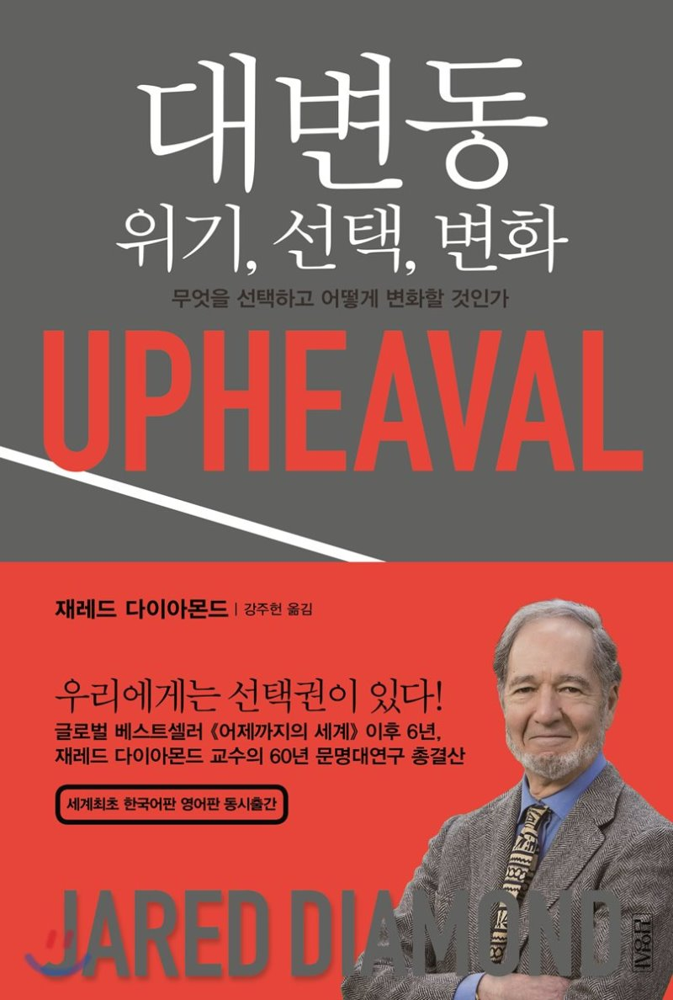

## 저자 : 재레드 다이아몬드 / 김영사

## 읽은기간 : 19. 09. 29  ~ 19. 10. 04

### 총균쇠의 저자, 제레드 다이아몬드의 따끈따끈한 책이다.

### 600페이지 분량이며, 번역도 큰 문제 없이 잘 되어있다.

### 이 책 역시 빌게이츠가 강력하게 추천하여 읽게 되었다.

### 10년전 쯤 총균쇠를 읽었었는데, 그 책보다는 그 이전에 읽었던 유시민의 거꾸로 읽는 세계사와 비슷한 구성이다.

### 국가적 위기의 결과와 관련한 요인을 12가지로 구분하고,

### 일곱 국가(핀란드, 일본, 칠레, 인도네시아, 독일, 오스트레일리아, 미국)의 근현대에 있었던 위기와 극복의 역사를 논하면서

### 이 12가지 기준을 가지고 각 나라별로 대입하여 설명한다.

### 후반부에서는 앞으로 닥칠 미래의 각각의 위기들 (일본, 미국, 전세계적)에 대해 어떻게 대응해야 할지 대해서도 논한다.

### 특히 인상깊었던 부분은 독일편,일본편,미국편이었다.

### 1. 독일의 과거사에 대한 반성

#### 빌리 브란트 총리의 폴란드 바르샤바에서의 1970년에 있었던 일명 브란트의 무릎꿇기,

#### 나치에 협력했던 평범한 사람들까지 단죄를 해야 한다고 했던 원칙주의자 프리츠 바우어

### 저자는 특히 빌리 브란트 총리의 여러 정책들이

### (과거사에 대한 진심 어린 반성으로 인한 주변국가와의 화해,동유럽 국가와 의 친선, 2차대전때 빼앗긴 옛땅을 포기)

### 통일 독일의 기반을 닦았다고 극찬을 했다.

### 2. 일본의 번영과 삽질

### 19세기 후반 제국주의 국가들의 침략에 대비하여 위기를 인식하고, 메이지 유신을 통해 근대화를 이루어낸

### 시대의 일본에 대해 긍정적인 평가를 하지만, 그후 팽창주의 군국주의에 빠져 자멸을 하고,

### 다시 현대시대에 무분별한 자원 소모와 과거사에 대한 반성을 하지 않는 일본에 대해 부정적인 시각을 내비쳤다.

### 또한 일본사회의 문제를 논하는 부분에서는 특이하게도 현재 1억2천의 인구인 일본이 출산율 저하로 인하여 8천만이 되어도

### 일본의 땅 넓이에 기초한 자원소모적 측면에서 오히려 이점을 얻어 큰 문제가 없을것이라는 예측을 하고 있다.

### 그러나 출산율이 아닌 일본의 초고령화에 대해서는 우려를 표했다.

### 3. 현대 미국의 어두운 측면

### 미국은 찬란했던 승리의 역사들 때문에 다른나라에서 배울것이 없다는 미국인의 생각에 대해 위험하다고 평하고 있으며,

### 당면한 위기중 가장 큰것은 정치의 양극화라 하였다. 양당의 타협은 사라지고, 상대방을 비난하고 끝까지 반대하는 모습이

### 최근 20년간 심화되었고 그 원인에 대해 깊이있게 논하였다.

### 개인적으로는 바로 전에 읽었던 21세기를 위한 21가지 제언보다 재미가 있었다.

### 특히 각국가들의 과거의 역사를 설명한 부분은 거의 몰랐던 부분들 이었기 때문에 흡입력이 있었다.

