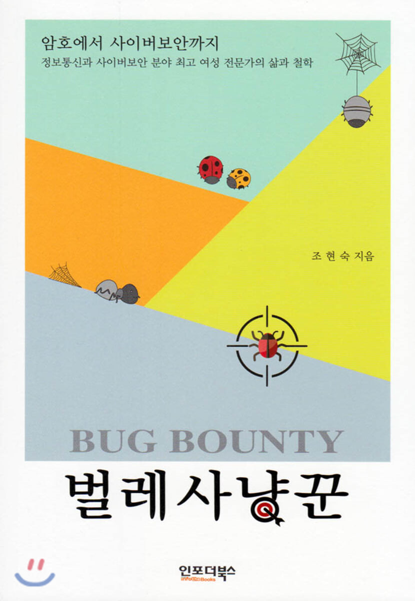

## 저자 : 조현숙 / 인포더북스

## 읽은기간 : 19. 12. 02  ~ 19. 12. 03

### 국가 보안기술연구소장께서 저자인 책이다.

### 가히 올해 최악의 책이라 할수 있다.

### 목차에는 웜, DDOS, APT, Malware. PGP, 블록체인과 가상화폐 등등이 적혀져 있어서

### 온갖 보안기술에 대한

### 저자의 지식이나 경험을 이야기 해줄것 처럼 냄새를 풍기는데,

### 말그대로 냄새만 풍기고, 아무 내용도 없다.

### 국가 보안 기술연구소장이라며..

### 책 팔려고 목차를 그리 해놓은것으로 생각된다.

### 글 솜씨도 거의 바닥이다.

### 오프라인에서 이책을 한번 훑어봤으면 안샀을텐데..

### 열 받아서 책파는 싸이트에 가서 별한개 주고 서평을 달아놓았다.

### 돈 날렸다.
