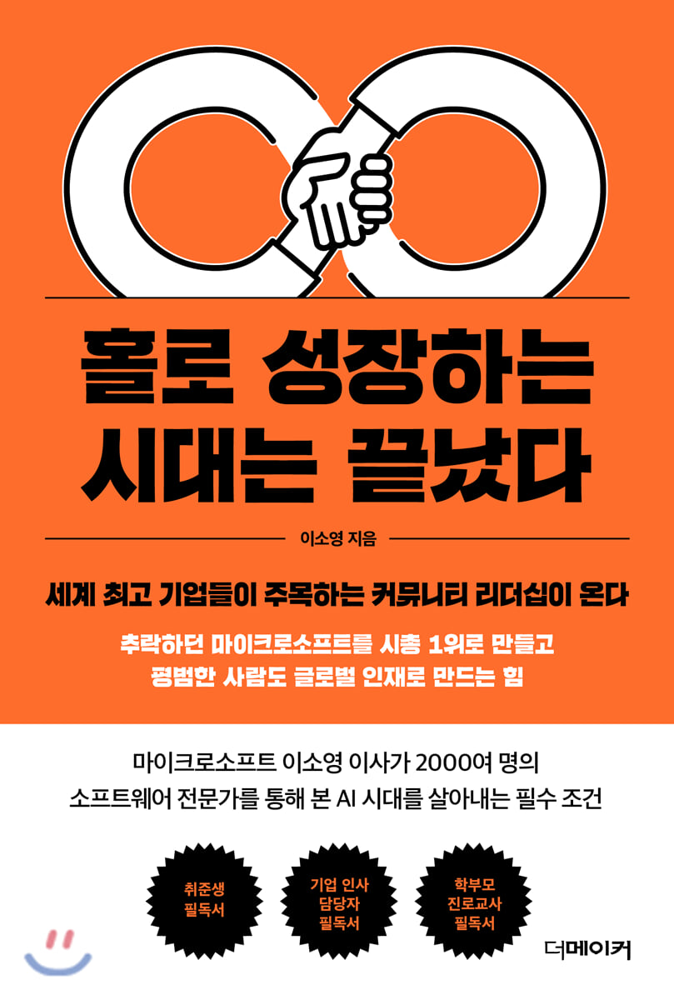

## 저자 : 이소영 / 더메이커

## 읽은기간 : 19. 12. 03  ~ 19. 12. 05

### 페이스북 커뮤니티 등지에서 나름 핫하 길래 읽어보았다.

### 왜 페북 커뮤니티에서 핫한지 알았다.

### 커뮤니티를 만들어서 리더가 되라는 내용의 책이기 때문..

### 마이크로소프트에서 MVP들을 관리하는 롤을 맡은 저자가 그들을 보면서 나름 느낀점을 적은 책이다.

### 대부분 기술 커뮤니티를 조직해서 리더로 활동하는 사람들로,

### 커뮤니티를 만들어서 스터디를 하는방법이

### 요즘 시대에 필요한 인재가 되기 위한 가장 알맞은 공부법이라는 주장을 하고 있다.

### ..틀린말은 아닌것 같기도 하다..

### 사교육, 공교육에 대한 본인에 대한 생각을 쓴 부분은 좀 갸우뚱 하는 부분이 있긴하다.

### 가령 이런 부분 -->

### "사교육이 변해야 한다. 학부모도, 사교육에 종사하는 선생님들도 단기적인 성과에 집착해서 우리 아이들의 미래와 사회를 망치는 일을 하면 안된다."

### '아니 이런말은 다들 아는 이야기이고, 누구든 할수 있지 않나, 변하기 싫어서 안변하나,

### 변화에 누구보다도 민감한게 사교육 시장인디..이유가 있으니까 그렇지'

### 등등 생각을 해보았다. 그럼 이만.
