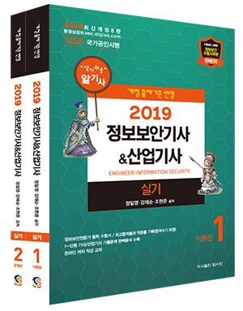

## 저자 : 조현준 / 탑스팟

## 읽은기간 : 19. 10. 15  ~ 19. 11. 08

### 정보보안 기사 실기책이다.

### 작년에 2017 책으로는 한 몇달 빡공했었는데

### 이책으로는 한달정도 열심히 공부했다.

### 정보보안 기사 실기시험 문제의 70프로 정도는 커버 할수 있다.

### 나머지 30프로는 어떤 문제가 나올지 몰름 하늘에 맡기는 수밖에 음슴..

### 저자 직강을 들었었는데, 워낙 어디서 어떤 해괴한 문제가 나올지 몰라서

### 그양반은 이 시험이 70점이 만점이라 생각한다고 함..

### 나도 이번 시험에때 딱 30프로정도 듣도 보도 못한 문제를 받아서

### 아 또 망이구나 직감했었다.

### 어쨌든 내년에도 또 봐야할 책이다.

### 영진닷컴 책보다 훨씬 낫다.

### 다음번에는 꼭 합격하자

#### 그럼이만.
