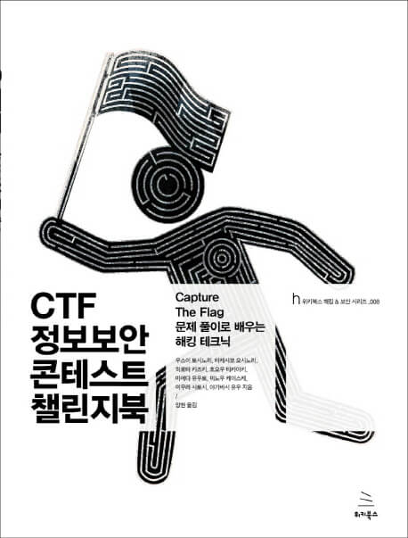

## 저자 : 우스이 토시노리 등 / 위키북스

## 읽은기간 : 19. 10. 13  ~ 19. 10. 24

### 올해 10월, 사내에서 CTF라는 일종의 해킹대회를 참가 하게 되어서

### 책을 사서 봤었다.

### 파일 바이너리 분석, PWN, 네트워크 분석, 웹취약점 찾기, SQL 인젝션 등등

### 그중에 일부 기초 해킹 방법들을 소개하는 책이다.

### 이 책보고 해킹대회에서 원래 알던것보다 몇문제 더 풀었었다. (SQL 인젝션, 웹 취약점 등)

### 각 분야별로도 책 한권씩은 족히 나올텐데 그것을 모아놓다 보니 깊은 내용은 아니었다.

### 어차피 내가 그쪽 분야 해킹에 대해 심도깊은 내용을 파고 들만한 레베루도 아니라서, 나름 만족

