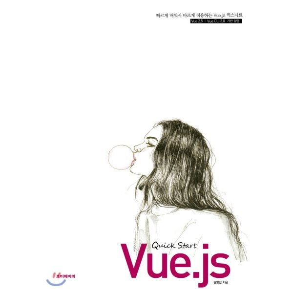

## 저자 : 원형섭 / 루비페이퍼

## 읽은기간 : 19. 12. 02  ~ 19. 12. 08

### 이번주에 멀티캠퍼스에서 Vue 강의를 수강했을때 받은 책.

### 주말에 한번 다시 읽어보았다.

### 저자 직강이었다.

### 원형섭 강사님은 7년전 신입때,

### Oauth2.0 & OpenAPI 강의 때도 한번 수강했었던 적이 있다.

### 강의는 여전히 열정적으로 잘하신다.

### 현재 프론트엔드 쪽 3대장중, 하나인 Vue에 대한 책이다.

### 기본적인 Vue 프레임워크 사용법부터 시작해서 Vuex, Vue Router , 마지막 Transition까지 나온다.

### 책에 있는 내용 그대로 강의를 들었기때문에, 책을 쭈욱 다시 읽어보니

### 강의 내용이 약간, 쬐끔 더, 생각이 나는군, 덕분에 내용 이해는 술술 된다.

### 그동안 모바일쪽만 해와서 이쪽은 초심자이긴 한데, 그래도 나름 (아직까지는) 할만 하다.

### 열심히 갈고 닦아서, 계속 할만하게 만들어야징 그럼이만.
