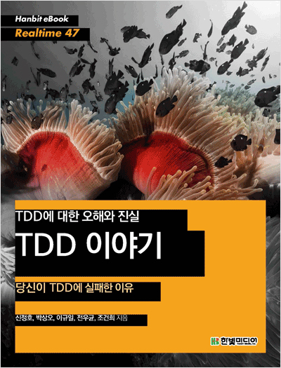

## 저자 : 10XP팀  / 한빛 미디어

## 읽은기간 : 19. 12. 15  ~ 19. 12. 17

### TDD - 테스트 주도 개발에 관한 노하우가 담겨 있는 책이다.

### TDD에 대한 오해와 진실을 담고 있다고 광고 하고 있다.

### TDD는 아는사람은 알다시피 Kent Beck이라는 전설적인 개발자

### < 애자일 선언문에 명단으로도 들어있고, XP를 창시하고 주도 하고 있는 사람들 중 하나이며

### 수많은 프로그래밍계 바이블 (주로 테스트 쪽하고.. 익스트림 개발방법론 쪽, 마틴 파울러와 같이 쓴 리팩토링도 있고..)

### 을 저서로 남기고 있는 리빙 레전드,

### 그리고 Junit을 에릭 감마 (Gang of four의 멤버 줄여서, Gof 디자인패턴으로 유명)와

### 비행기타고 가는중에 1.0 버전을 맨든것으로도 유명 >

### 가 책을 써서 유명해진 소프트웨어 개발방법론중 하나이다.

### 매번 해볼라 카다가 이런저런 이유로 잘 안하게/못하게 되었다능..

### 내년엔 좀 진지하게 조금이라도 도전 해볼라고 한다.

### 책에서는 TDD를 많이 경험한 필자들이 (어디 회사 연구소 팀이라고 하는것 같다)

### 주로 장점 및 오해에 대해서 이야기 하고 있다. 예제도 조금 보여주고

### 근데 책에서는 유닛테스트와 TDD는 다르다 라고 이야기 하면서도 장단점을 꼽을때,

### 구분을 안하고 혼동해서 쓰고 있는 느낌이 있긴한데..

### 일단 내가 생각할때는 유닛테스트와 구분되는 TDD 방법론만의 장점으로는,

### 코드자체가 테스트하기 편하게, 즉 testable한 코드로 처음부터 설계가 되어,

### 그에 따른 장점들(뭐 SOLID 원칙이라던지, 조각조각 모듈화가 잘된다던지,

### 유닛테스트를 효과적으로 만들수 있어서 높으신분들이 좋아하시는 높은 테스트 커버리지를 얻을수 있다 라던지.. 그런것들..)을 취할수 있다는점이 제일 큰것 같다.

### 책 내용은 두껍지도 않고 한번쯤 읽어볼만했다. 어쨌든 문제는 실천이지. 실천을 잘해야 겠다.
