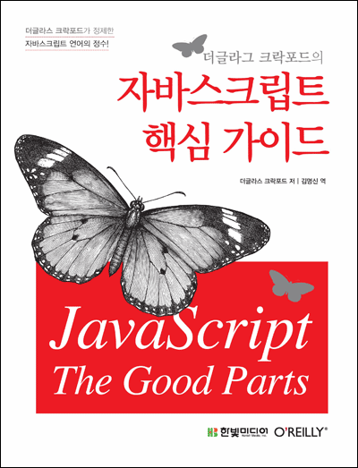

## 저자 : 더글라스 크락포드  / 한빛 미디어

## 읽은기간 : 19. 12. 17  ~ 19. 12. 20

### 같은 부서에 근무하고 있는 분이 추천해줘서 읽었다.

### 예전부터 여러가지 이유들로 인해(아래에 쓴 내용도 포함) 자바스크립트를 안 좋아했지만

### 하고 싶은거만 어떻게 하고 사나, 먹고 살려면 하는 수밖에..

### 아무튼 이책은 기본서는 아니고, 약간 더 중급자로 가기 위한 책이다.

### 바닐라 자바스크립트에 대한 문법만 딱 다루고 있다.
 (+ JSLint 쪽 내용까지)

### 이펙티브 시리즈 (특히 이펙티브 C++)와 약간 컨셉이 비슷하지 않나 싶다.

### 자바스크립트는 언어적으로 허용하는 문법은 굉장히 다양한데,

### 그러면서 쓰지 말아야할 문법들이 많아서

### 일단 이책을 보면 이렇게 쓰면 망한다가 주로 다수의 내용이다.

### (예전에 하던 기억으로는 C++도 안티패턴이 수두룩 했다.)

### 어쨌든 잘 알아둬야 하는 내용은 맞는것 같다. 아무생각없이 휘갈겨도 에러나 워닝이 안뜰수 있으니 동작은 하나 원하는 동작이 안할수 있다는 뜻이니

### 전반적으로 부실하지 않고 충실히 잘 써져있다. 고수가 쓴 책이라는 느낌이 물씬 든다.

### 단 정말 책에 나온 예제 스타일로만 프로그래밍하진 않을것이다.

### 이 책에서는 다 그냥 이것저것 셀프로 만들어서 쓰는데, 요새 최소 유틸리티 라이브러리라도 안쓰는 프로젝트가 없으므로..

### 언어자체가 단점이 매우매우 많다. 커피 스크립트, 타입 스크립트, ECMA 최신 문법등이 계속해서 나오는 이유라 생각한다.

### 개인적으로는 컴파일타임에 빡시게 타입체크도 하고 에러도 내주는 강타입에 정적언어가 좋다.

### 최근에 써본 언어중에서는 역시 코틀린이 제일 낫다고 (+ IntelliJ 와의 궁합도 너무 좋아서) 생각한다.
