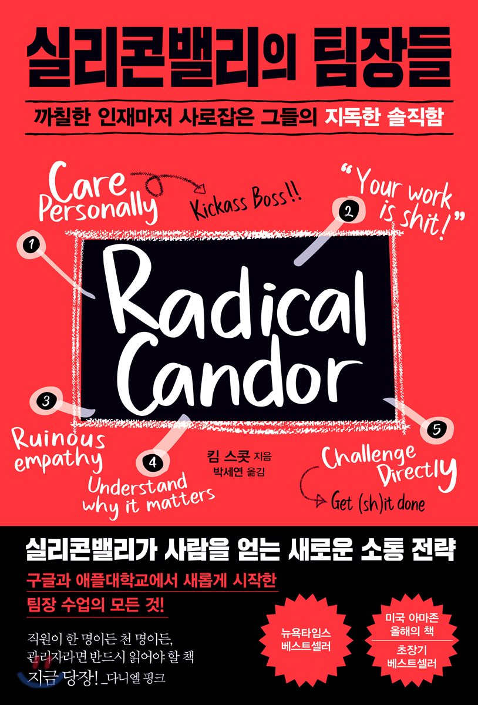

## 저자 : 킴 스콧  / 청림 출판

## 읽은기간 : 19. 12. 13  ~ 19. 12. 22

### 조직을 관리하는 방법에 대한 노하우를 담은 책이다.

### 저자는 현재 Candor라는 회사의 CEO이며,

### 과거 구글과 애플에서 조직문화를 구축하고 조직을 관리하는 경험을 하였었다.

### 책에 두루두루 래리 페이지, 세르게이 브린, 스티브 잡스, 조너선 아이브,

### 트위터의 CEO였던 딕 코스톨로 등에 대한 이야기들이 많이 나온다.

### 상사가 직원에게 개인적인 관심을 기울이고,

### 직원들과의 의사소통을 할때 직접적으로 서로 대립할수 있는 분위기를 만들었을때,

### 완전한 솔직함이라는 관계가 되고, 이러한 관계가 될수 있어야

### 개인과 조직이 최고의 퍼포먼스를 낼수 있다 하였다.

### 그렇게 되기 위한 여러가지 방법들, 사례들,

### 그리고 완전한 솔직함이 아닌 나머지 세가지의 관계들에 대해서도 설명하고 있다.

### 책을 읽으면서 관리자라는 역할의 어려움에 대해 새삼 다시 생각하게 되었다.

### 최고의 관리자는 감정 노동의 달인이라는 말도 인상 깊었다.

