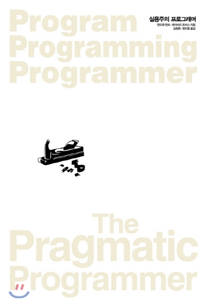

## 저자 : 앤드류 헌트, 데이비드 토머스 / 인사이트

## 읽은기간 : 19. 12. 07  ~ 19. 12. 25

### 애자일 선언에 참여한 17인의 인물 중 2명에 의해 오래전에 쓰여진 책이다.

### 고전 바이블이라 할수 있다.

### 책 내용에서 보면 애자일 선언문 (2001년 즈음) 이전에 쓰여졌다고 하니

### 한 20년 된 책이다. IT 업계에서 이정도면 아득히 먼 옛날..

### 대학생때 읽어본적 기억이 있다. 십년이 넘은듯.. 그때는 녹색바탕 표지 였었다.

### 내용은 기억이 안났다. 지루했던 기억만 있었다.

### 이책의 부재는 '숙련공에서 마스터'로 이다.

### 어느정도 개발을 할줄 아는 사람이 더 높은 단계로 가기 위한 지혜들이 총망라된 책이라 할수 있다.

### 그렇지만 너무 오래전 책이라, 현재의 방식과는 맞지 않는 부분도 있고

### (두루두루 나옴, ex : IDE를 너무 의존하지 마라?...),

### 이미 보편화가 되어진 분야

### (메타 프로그래밍이라던지, 코드 자동생성 -템플릿 만드는거 , 리팩토링, MVC패턴 ,

### 소스코드 관리, 프로토타입, 테스트 자동화, 동시성/병렬성을 최대한 활용하라 등)도 있고

### 무슨 이야기인지 이해가 가지않는 내용들도 (칠판, 계약에 의한 설계 등) 있었다.

### 물론 그때나 지금이나 변하지 않는 진리에 관한 내용도 어느정도 포함 되어있었다.

### 그중

#### 명세의 함정 - 어떤일을 글로 설명하는것보다 실제로 하는게 쉽다

#### 동그라미와 화살표 - 어떤 방법의 거짓된 권위에도 넘어가지 말라. 사람들이 펼치면 몇백평이

#### 넘을 클래스 다이어그램 종이 뭉치와 유스 케이스 150개를 들고 회의에 들어오더라도,

#### 그 모든것 역시 틀릴 가능성이 있는 요구사항과 설계에 대한 그들의 해석일 뿐이다.

#### 어떤 도구의 결과물을 볼 때 비용이 얼마나 들었을지 생각하지 않도록 노력하라.

#### 형식적인 방법들은 분명 개발과정에서 자기 자리가 있다.

#### 하지만,

#### 프로젝트의 철학이 "클래스 다이어그램이 바로 애플리케이션이다. 나머지는 기계적인 코딩일뿐이다."

#### 인 프로젝트를 보게 된다면,

#### 여러분은 아직도 가야할 길이 먼데 배는 물에 잠겨 들어가는 느낌이 무엇인지 알게 될 것이다.

#### 오만과 편견 - 익명성은 특히 큰 프로젝트에서 적당주의, 실수, 태만 그리고 나쁜 코드의 번식지가 될수 있다.

#### 이렇게 되면 훌륭한 코드 대신 끝없는 상황 보고 속에서 어설픈 변명만 생산해 내는 거대한 기계의 한 부속품으로 스스로 전락해 가기 쉽다.

### 등의 내용들은 인상 깊었다.

