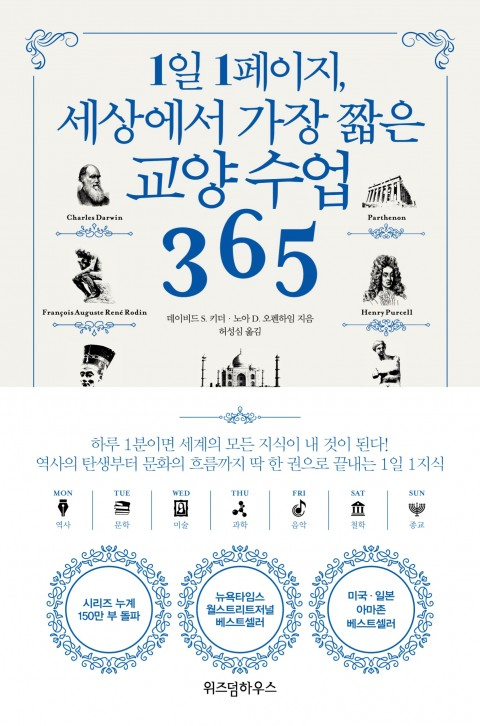

## 저자 : 데이비드 S.키더 , 노아 D. 오펜하임 / 위즈덤 하우스

## 읽은기간 : 19. 12. 28  ~ 19. 12. 31

### 2019년 마지막으로 읽은 책이다.

### 역사/문학/미술/과학/음악/철학/종교 순으로 반복되며 옴니버스 식으로 365편의 글을 다룬 책이다.

### 400페이지 정도인데, 페이지당 텍스트가 제법 많아서, 생각보다 오래 걸렸다.

### 철저하게 서양인의 시각으로, 각 분야들을 이야기 하고 있다.

### 예를 들면 종교는 거의 유대교, 기독교, + 이슬람교에 대한 내용이 대부분이며,

### 불교/유교/도교/힌두교/시크교/신토 등을 한두 편정도 씩 다루고 있다.

### 크게 불만은 없다.

### 음악 쪽은 어려운 부분도 많았다.

### 이쪽분야는 워낙 문외한이라 무슨말인지 모를 용어들도 많고..

### (예를 들면, 12음 음렬주의 , 자유 무조성, 다선율? 이런것들..)

### 철학쪽도 마찬가지고.

### 그래도 한번쯤 읽어볼만 했다.

### 흥미로운 부분도 꽤나 많았다.

### 한 페이지 씩이지만 내용이 습자지 깊이 까지는 아니고, 골판지 정도 두께는 되는듯.

### 각 분야의 역사, 용어, 중요인물들 등을 한번씩 쭈욱 훑어줘서 좋았다.

### 정의편, 공리주의 편은 [정의란 무엇인가] 책의 내용과도 겹쳐서, 그때 읽었던 생각이 나고 좋았다.

### 오타가 꽤나 많다.

### 내용을 결정적으로 오해할수도 있는 오타도 있다.

### (기억이 정확히 안나는데 어떤 인물의 생몰년도와 작품 발표 년도가 완전히 뒤죽박죽이었다.)

### 눈에 상당히 거슬렸다.

