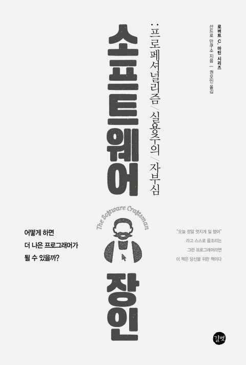

## 저자 : 산드로 만쿠소 , 권오인 / 길벗

## 읽은기간 : 20.01.02 ~ 20.01.05

### 3번째 읽는 책이다. 18년,19년,20년 한번씩.

### 그럴만한 가치가 있다.

### 그동안 읽은 책중에 개발자의 행동양식에 대한

### 내용을 담은 서적으로는 최고인것 같다.

### 개발자의 프로페셔널리즘에 대한 내용들을 담고 있다.

### 번역도 굉장히 깔끔하고,

### 담긴 사례나 비유도 실제 현장과 바로 매치될정도로 날카롭다.

### 인상깊었던 대목들을 적어 본다.

#### 1. 오래전에 작성했던 코드를 지금에 와서도 고칠 부분이 없어 보인다면,

#### 그것은 그동안 배운것이 없다는 뜻이다.

#### 2. 프로라면 아니오 라고 말할수 있어야 한다.

#### 일정 안에 모두 완료 하는것이 거의 불가능한 상황이라는 것을 분명히 알면서도

#### 상사에게 노력해보겠다고 라는 말을 어떻게 할수가 있나? 노력해 본다는 것의 의미가 무엇인가?

#### 열심히만 하면 갑자기 불가능하던 일이 가능해지고 전부 완료할 수 있다는 것인가?

#### 아니면 개인생활과 가족을 모두 희생하고

#### 야근과 휴일 근무를 밥먹듯이 하겠다는 뜻인가?

#### 그런뜻이라면 오래 일한다고 달라지는 것이 있나?

#### 그렇지 않다면 평소 일을 대충하고 있다는 고백임과 동시에 거짓말을 하고 있다는 것이 된다.

#### 그저 실망시키지 않게 하기 위해 말하는 '네' 는 거짓말에 지나지 않는다

#### 그냥 거짓말이 아니라 중독적이고

#### 파괴적인 습관이다. 양의 탈을 쓴 나쁜 습관이다.

#### 당신이 불가능한일을 '네' 라고 말할 때 사람들은 그말을 믿고

#### 그에 의존해서 계획을 짠다는것을 반드시 기억 해야 한다

#### 회사 전체의 피해를 입힐수 있다.

#### 3. 진정으로 당신을 둘러싼 것들을 바꾸고 싶다면 몇가지 꼭 갖춰야 할 것들이 있다.

#### 가장 중요한것은 용기이다.

#### 동료 개발자, 관리자, 기술 리더와 언성이 높아지는 논쟁을 두려워해서는 안된다.

#### 의견 충돌이 없는 마음 편한 대화만을 기대할 수는 없다.

#### 싸울 준비가 되어 있어야 한다.

#### 당신이 생각하는 내용이 어떤것이든 말할수 있는 용기가 있어야 한다.

#### 4. 나의 상사를 어떻게 설득 할수 있을까?

#### 이에 대한 답은 '설득할수 없다' 이다.

#### 용서를 구하는것이 허락을 구하기 보다 쉽다.

#### 그냥 가서 하고 싶은것을 하면 된다.

#### 관리자들이 원하는것은 고객과 이해관계자들의 만족이다.

#### 개발자들이 TDD를 하던 페어 프로그래밍을 하던 지속적인 통합을 하던 상관하지 않는다.

