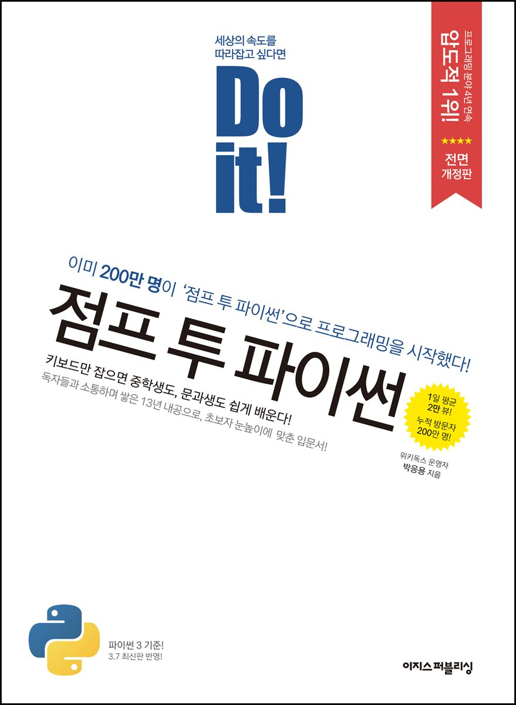

## 저자 : 박응용 / 이지스 퍼블리싱

## 읽은기간 : 20.01.07 ~ 20.01.11

### 파이썬을 공부할 일이 있어서, 사서 읽었다.

### 내 기억에 대학교때 연구실에서 세미나로 내가 파이썬을 소개했던적이 있었다.

### 10여년이 넘었었는데, 그때도 배우기 쉽고, 생산성이 엄청나다 어쩌고 저쩌고

### 소개만 하고 이거를 가지고 뭔가 한적은 없었다.

### 아무튼 완전 초보를 위한 책이기도 하고, 언어 자체가 배우기 쉬운언어여서

### 술술 읽고 넘어가는데는 문제가 없었다. 마지막 정규식 내용빼고는..

### 책자체는 파이썬 입문자들에게 다들 추천하는 아주 유명한 책이기도 하고,

### 설명도 잘 쓰여져 있는것 같다.

### 프로그래밍 언어는 책을 읽었다고 되는게 아니라, 실습이 중요하므로

### 실습을 많이 해보려고 한다.
