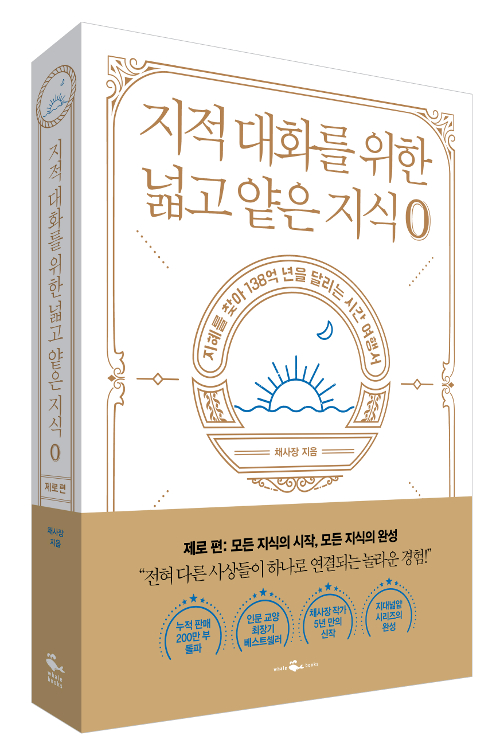

## 저자 : 채사장 / 웨일북

## 읽은기간 : 20.01.07 ~ 20.01.15

## 556 pages

### 어렸을때는 우주에 관심이 많았었다.

### 우주에 대한 책이나 영화나 다큐멘터리를 많이 보았더랬다.

### 세부 공식이나 어려운 내용은 몰랐지만,

### 이런저런 이론도 알아보려고 애를 썼었다.

### 양자역학의 관찰자라는 개념에 대해 알았을 때 남들처럼

### 혼란을 느끼기도 했었다.

### 이책은 빅뱅/다중우주/평행우주/양자역학 등등 우주에 대한 설명부터

### 시작해서 베다/도가/불교/기독교등 동양, 서양 철학들을 훑는다.

### 거기에 사람들을 지배하고 있는 두가지의 거대한 세계관인 이원론과 일원론을 설명한다.

### 기본적으로 철학에 대한 책 임에도 불구하고,

### 현대 물리학의 언어로

### 우주에 대해 이야기 하는

### 도입부 부터 어려운 개념을 쉽게 이해할수 있도록 잘쓰여져 있다.

### 왠만한 우주 과학 책보다 나은것 같다.

### 그러나 여기서 끝은 아니다.

### 장마다 새로움, 놀라움 투성이다.

### 범아일여/도와 덕/일체유심조/관념론/내면의 신..

### 베다/도가/불교/서양철학이 모두 세계와 자아의 합일이라는

### 일원론에 도달한다는

### 이책의 주된 주제는 매우 흥미로웠다.

### 특히 칸트의 관념론에 대한 이야기중 page 468-471는

### 머리통을 사정없이 망치로 때리는 기분이었다.

### 작가의 종교/철학/역사/과학 등등에 대한

### 넓고 깊은 지식과 상상력, 통찰력,

### 조리있고 설득력있게 이야기를 쓰는 재주가 부럽다.

### 그냥 책쓰는 사람이 아닌 달인 or 도인의 내공이 느껴진다.

### 작가는 책에서 마지막에

### "당신이 언젠가 당신의 내면 안에서 찬란히 빛나는 세계의 실체와 마주하게 되기를 바란다."

### 라고 말하면서 끝맺음을 한다.

### 개인적으로도 그런날이 왔으면 하는 바램이다.
