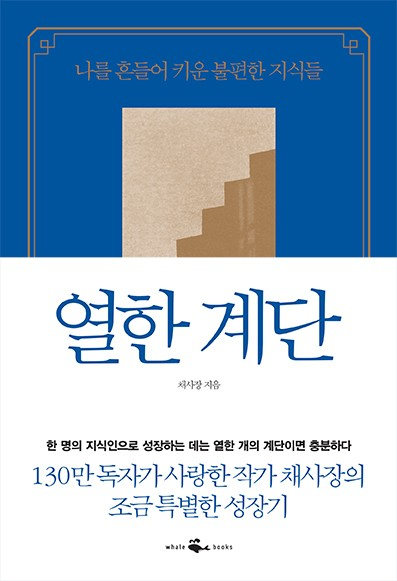

## 저자 : 채사장 / 웨일북

## 읽은기간 : 20.01.17 ~ 20.01.18

## 407 pages

### 지적 대화를 위한 넓고 얕은 지식 제로를 읽은후,

### 채사장이라는 사람에 대해 호기심이 생겨 책을 골랐다.

### 글쓴이의 자아 성장기를 글로 옮긴 책이다.

### 철학이야기 + 정반합의 과정을 거쳐 열한 계단의 성장을

### 한 본인의 삶을 담담히 적은 수필에 가깝다.

### 내용을 보니 역시나 남들과는 조금 다른 생각을 하며 살긴 살았던것 같다.

### 저자는 내적 성장을 위해서는

### 불편함의 계단을 올라야 한다고 하였다.

### 그러기 위해서는 익숙함 만을 쫓지 말고,

### 기존 본인의 세계관을 무너뜨릴수 있는 반대의 경험을 하거나,

### 그런 종류의 책을 읽으라 하였다.

### 이 과정을 반복하면 자기 세계의 지평을 점차 넓힐수 있다 하였다.

### 인상 깊었던 내용 몇가지를 적자면,

#### 출항과 동시에 사나운 폭풍에 밀려다니다가

#### 사방에서 불어오는

#### 바람에 같은 자리를 빙빙 표류 했다고 해서,

#### 그 선원을 긴 항해를

#### 마친 사람이라고 말할수는 없을 것이다.

#### ...그는 긴 항해를 한것이 아니라

#### 그저 오랜 시간을 수면위에 떠 있었을 뿐이다.

#### 그렇기에 노년의 무성한 백발과 깊은 주름을 보고

#### 그가 오랜 인생을 살았다고

#### 단정할 수는 없는 일이다.

#### 그 백발의 노인은 오랜 인생을 산것이 아니라

#### 다만 오래 생존한 것일지 모른다.

#### ...범아일여의 깨달음이 영원한 자유에 이르게 할 것이다.

#### 그것은 윤회의 고리를 끊고 너를 놓아 줄 것이다.

#### ...제가 오늘 <<우파니샤드>>를 여러분에게 소개한 이유는

#### 다른 문화권의 종교를 알아보는 즐거움 때문이 아닙니다.

#### 또 <<우파니샤드>>가 탁월한 진리이니 기존에 믿던 종교와

#### 사상을 버리고 이것을 믿으라 하는것도 아닙니다.

#### <<우파니샤드>>는 도움이 됩니다. 무엇에 도움이 됩니까?

#### 바로 당신이 이 세상의 유일한 주인공이었음을 깨닫게 합니다.

#### 당신이 바로 그것입니다. 감사합니다.

