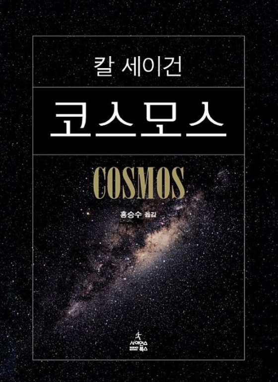

## 저자 : 칼 세이건 / 사이언스북스

## 읽은기간 : 20.01.03 ~ 20.02.09

## 720 pages

### 옛날부터 읽고 싶었던 책이다.

### 과학을 좋아하는 일반인들에게는 꼭 읽어야 하는

### 교양 서적이며,

### 유시민 작가가 알뜰신잡에서

### "딱 한권 들고 가서 무인도에서 내가 죽은 날까지 살아야 한다면 이책을 가져가고 싶다."

### 라고 할정도로 명성이 있는 고전의 반열에 오른 스테디 셀러이다.

### 꽤나 두꺼운 두께때문에 미루고 미루다가

### 곧 코스모스 다큐멘터리 시즌 3가 시작하기도 하고,

### 이번이 기회다 싶어서 읽게 되었다.

### 읽기가 쉬운 책은 아니다.

### 초반에는 잘 안읽혔다. 중반 이후부터는 ..역시나 빠져들기 시작했다.

### 무려 40년전에 초판이 나온책이고, 저자인 칼 세이건이 별세한지도 25년이 되었지만

### 몇몇 일부 부분을 제외하고는 그런정도의 세월이 느껴지지 않는다.

### 총 13장으로 구성되어 있으며, 우주와 지구, 화학, 인간과 자연, 진화, 철학, 종교,

### 인간의 역사에 대한 이야기들을

### 저자의 깊고도 넓은 지식들을 바탕으로 엮어내었다.

### 딱딱한 과학 책이 아닌

### 여러 편의 동화를 읽는 것 같은 느낌도 들고,

### 어릴적 우주에 대해 호기심이 많던 소년으로 되돌아간 기분이었다.

### 그중 가장 흥미로웠던 부분중 하나는 행성 탐사선 보이저를 계획하고 만들고

### 띄워 보낸후, 그것을 이용한 연구들에 대한 생생한 경험담 들이었다.

### 다 읽은 후에는 드디어 이책을 읽었다는 성취감과 함께 여운이 상당히 짙었는데,

### 아마도 이 느낌이 꽤나 길게 갈것 같다.

