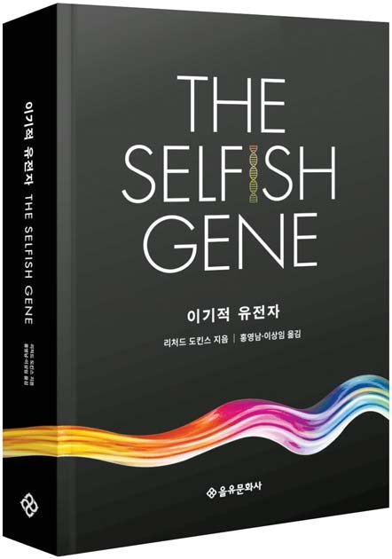

## 저자 : 리처드 도킨스 / 을유 문화사

## 읽은기간 : 20.02.11 ~ 20.02.21

## 630 pages

### 첫 발행된지 무려 45년이 된 고전이다.

### 생물의 진화에 대한 과학 서적이다.

### 읽은 후에는 세계관이 바뀌는 듯한 경험을 한다고 알려진 책이다.

### 역시나 초반부터 생물에 대한 기존의 선입견,

### 상식이라 생각했던 지식을 낱낱이 부숴버린다.

### 각 장마다 머리통을 사정없이 두들기는 내용들 뿐이다.

### 강력하게 추천할수 밖에 없는 책이다.

### 출간한지 거의 반백년이 되었고,

### 학계에서도 교과서적인 정설로 인정 받은지 오래인데

### 왜 나는 이 책의 내용이 새로울까

### 읽으면서 궁금해졌었다.

### 그리고 이책의 내용들은 생물학의 측면이 아닌

### 철학, 종교적인 측면에서도

### 무시하지 못할 영향력을 발휘하지 않나 하는 생각이 든다.

### 저자도 언급한 바

### 근 이천년을 지배했던 창조론적 사고를 무참히 깨뜨린

### 진화론의 다윈이 근대 및 현대의 철학사에서

### 거의 다루어 지지않는것도

### 생각해보니 이상하다.. 라고 깨닫게 되었다.

### (그래서 저자는 종교,철학 관련자의 반박을 많이 받았었고,

### 지난 몇십년동안 계속 논쟁을 했다 한다 - 만들어진 신의 저자이기도 하다.)

### 아무튼 내용을 좀 보면,

### 생물을 그들 종 전체나 그 종의 한 개체의 관점이 아닌,

### 해당 개체안의 유전자의 관점으로 진화를 논한다.

### 생물의 진화나 번영, 소멸을 위한 자연선택의 단위가

### 개체가 아닌 유전자 단위라는 것이다.

### 각 개체는 유전자 (책내에서는 자기복제자라 칭함)가 자신을 복제하고 널리 퍼뜨려서

### 영원불멸이라는 이기적인 목적을 취하기 위한 수단일뿐이다.

### 말하자면 유전자가 본인의 생존을 위한 생존기계를 만든것이다.

### 아래의 내용으로 초반부를 시작하며,

### 각장마다 어마어마한 내용을 꺼내 들고와서 머리속에 펼쳐 놓는다.

#### 그들은 덜거덕거리는 거대한 로봇속에서 바깥세상과

#### 차단된채 안전하게 집단으로 떼지어 살면서

#### 복잡한 간접 경로로 바깥세상과 의사소통하고

#### 원격 조정기로 바깥세상을 조종한다.

#### 그들은 당신 안에도 내안에도 있다.

#### 그들은 우리의 몸과 마음을 창조 했다.

#### 그리고 그들이 살아 있다는 사실이야 말로

#### 우리가 존재하는 궁극적인 이론적 근거이기도 하다.

#### 자기 복제자는 기나긴 길을 지나 여기까지 왔다.

#### 이제 그들은 유전자라는 이름으로 계속 나아갈 것이며,

#### 우리는 그들의 생존 기계다.

