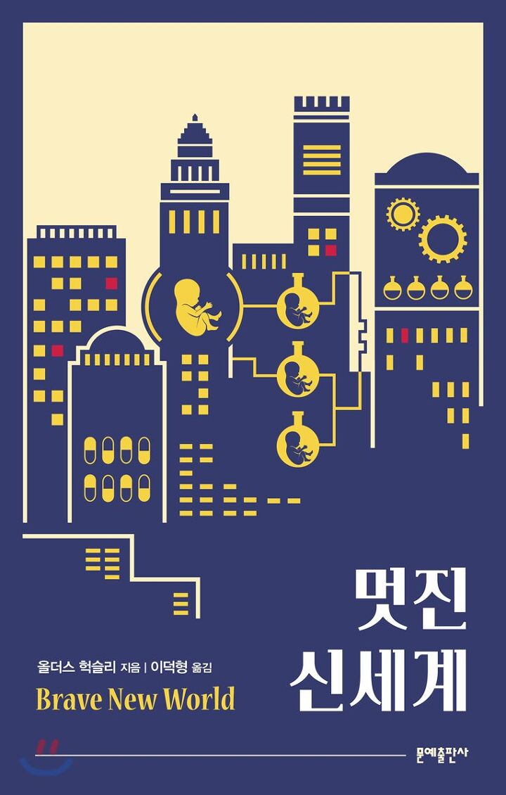

## 저자 : 올더스 헉슬리 / 문예 출판사

## 읽은기간 : 20.02.22 ~ 20.02.23

## 409 pages

### 올더스 헉슬리의 1932년 작품이다.

### 1984, 우리들과 함께 3대 SF 디스토피아 바이블이다.

### 지금으로부터 약 500년후, 포드 기원 632년..

### (자동차를 만든 그 포드 맞다. 대량생산 체제를 처음 만든 사람이라 작품내에서 숭배의 대상이 되었다.)

### 인류는 완전히 통제된 사회에서 계급을 가진채 태어나고,

### 세뇌되어, 섹스와 소마라는 마약에 의해 불만과 불안,

### 부족함등이 없는 사회의 일원이 되어 생활한다.

### 이 과정에서 인간들은 공장에서 인공수정으로 태어나 부모라는 존재가 없다.

### 세포때부터 여러가지 약물을 주입하여 낮은 계급의 경우,

### 단순 반복 노동만 하므로,

### 높은계급보다 신체능력과 지능을 모자라게 ,

### 자기 계급의 한 그룹끼리는 외모도 똑같이 만들어서 자연스럽게 계급 체계를 만든다.

### 이 체제에 불만을 가진 사람들이 나타나고, 그 사람들이 보호 구역내의 야만인

### (작품내에서는 야만인이라고는 하지만 우리의 관점으로 봤을땐 약간 정신세계가 독특한 현대인 정도의 포지션)을

### 문명세계에 데리고 오면서, 벌어지는 이야기이다.

### 1차대전과 2차대전 사이에 나온 작품이지만,

### 거의 100년이 지난 현대에서도,

### 흥미로운 설정 및 내용들이 많다.

### 아직까지 읽혀지고 있는 이유가 있는듯.

### 이 책의 주제의식을 담은 총통과 야만인 존의 대화가 기억에 남는다.

#### ... "우리는 여건을 안락하게 만들기를 좋아하네."

#### "하지만 저는 안락을 원치 않습니다. 저는 신을 원합니다.

#### 시와 진정한 위험과 자유와 선을 원합니다. 저는 죄를 원합니다."

#### "그러니까 자네는 불행해질 권리를 요구하고 있군 그래."

#### "그렇게 말씀하셔도 좋습니다."

#### ..."불행해질 권리를 요구 합니다"

#### "그렇다면 말할것도 없이 나이를 먹어 추해지는 권리, 매독과 암에 걸릴 권리.."

#### ... "온갖 표현할수 없는 고민에 시달릴 권리도 요구하겠지?"

#### 긴 침묵이 흘렀다.

#### "저는 그 모든것을 요구 합니다." ....

#### "마음대로 하게 " 하고 그가 말했다.

