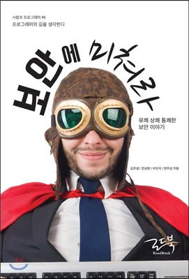

## 저자 : 김주생, 전상현, 차민석, 한주성 공저 / 로드북

## 읽은기간 : 20.03.16 ~ 20.03.18

## 279 pages

### IT 보안 전문가 4인의 이야기들을 담은 책이다.

### 다들 현업 경력이 10~20년 이상된 베테랑 보안 전문가들로써

### 나름 본인들의 생생한 경험, 생각들이 담겨져 있다.

### 다들 치열하고, 끊임없이 공부하고

### 자신의 일에 대해 사명감을 가지고 사는구나 하는 생각이 들었다.

### 나도 보안 솔루션 개발자이다 보니

### 특히 안랩에서 다양한 보안 솔루션을 개발했었던,

### 전상현님의 이야기가 가장 흥미로웠다.

### 다른 분들과는 달리 개발 관련 이야기도 많았고,

### 여러가지 이슈를 해결했었던 이야기,

### 고객들로 부터의 컴플레인을 받았던 이야기들도 인상 깊었다.

### 저자들은 내내 공통으로

### 보안 분야는 업무가 대체로 지루하고 반복적이며,

### 따라서 끈기가 필요하고

### 이슈가 발생하면 엄청나게 욕을 먹고 스트레스를 받기 때문에

### 쉽지 않다고 이야기 한다.

### 추가로 다들 영어에 대한 컴플렉스가 있는점도 흥미로운 포인트 였다.

### IT 보안이라는 분야도 워낙 업무가 다양하다 보니,

### 알지 못했던점을 많이 알게 되어서 느낀점도 많았고,

### 앞으로 이쪽 분야는 중요성이 더 커지면 커졌지

### 줄어 들지 않을 것이라는 측면에서 본다면

### 대충 이바닥에 반다리 정도 걸치고 있는 나로써는

### 계속 킵 고잉 해야겠다 생각이 들었다.

### 책도 두껍지 않아 부담없이 읽었다.
