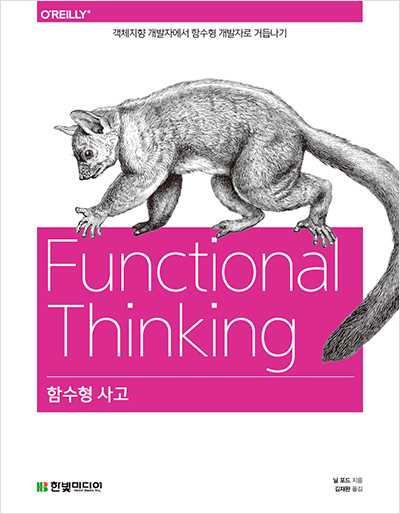

## 저자 : 닐 포드 , 김재완 옮김 / 한빛 미디어

## 읽은기간 : 20.03.21 ~ 20.03.24

## 200 pages

### 2016년 12월에 상하이 놀러갈때 들고

### 가서 읽었던 책을 다시 꺼내들었다.

### 스칼라, 그루비, 클로저, 자바 1.8 등의 언어로

### 표현된 객체지향, 명령형 표현들을

### 함수형 표현으로 바꿔가며,

### 함수형 프로그래밍이란 무엇인지,

### 왜 해야하는지, 장단점을 설명한다.

### 저자는 일단 사고 방식을 함수형으로 바꾸는것 부터 시작해야 한다고 말한다.

### 그렇지 않으면, 언어에서 제공하는 함수형 프로그래밍 도구들을 활용하기 힘들다고 하였다.

### 함수형 표현들을 사용해야 하는 이유에 가비지 컬렉션을 주로 예를 든다.

### 수동으로 메모리를 관리해야 하는 언어들을 사용할때,

### 양산되는 수많은 버그들을

### 가비지 컬렉션이 해결해준것 처럼 (그리고 이 기능이 없는 언어는 이제 다시는 사용하고 싶지 않은것 처럼),

### 골치아픈 작업들을 런타임에 떠넘기자고 이야기 한다.

### 다른 부차적인 부분에 신경을 덜쓰고,

### 실제 비즈니스적인 요구사항 구현에만 집중을 해야 한다고 이야기 한다.

### 또한 함수형 표현을 잘쓰면 애플리케이션의 구조나

### 구현하는 패턴들도 많이 바뀔수 있다 하였다.

### 이부분 중 인상 깊었던 부분은

### 한때 바이블로 추앙받았던 GOF 디자인 패턴중 몇가지가

### 함수형 언어에서 어떻게 바뀌는지에 대한 예였다.

### 플라이웨이트 , 전략 , 팩토리, 템플릿 메서드 등

#### 1. 패턴이 언어에 흡수된다.

#### 2. 패턴 해법이 존재하지만, 구체적인 구현 방식은 달라진다.

#### 3. 해법이 다른 언어나 패러다임에 없는 기능으로 구현 된다.

### 추가로 불변성, 특히 객체들이 들고 있는 프로퍼티의 불변성에 대해

### 중요하게 생각하라 한 부분도 새길만 했다.

### 이부분은 함수형 프로그래밍에서 특히 중요하게 생각하는 부분이지만,

### 사실 어떤 방법으로 개발 하던,

### 무조건적으로 지향해야 될 중요한 부분이기도 하다.

### 책을 읽으면서 각 언어로 제시되는

### 예제의 모든 코드를 다 해석하고

### 이해하려고 노력하지는 않았다. (정신건강에 해롭다.)

### 대충 맥락을 알려고 노력했다.

### 특히 클로저(언어)로 쓰여진 예제는 가독성 측면에서 읽기가 매우 어려웠다.

### 작년말부터 코틀린을 실전에서 쓰면서,

### 함수형 메커니즘들을 많이 사용해보려고 노력은 하고 있었다.

### 주로 컬렉션을 다룰때, map()이나 filter()를 많이 사용했었는데,

### 책 한권 더 읽었으니 많은 부분을 의식적으로 써먹어보도록 노력해 봐야겠다.

