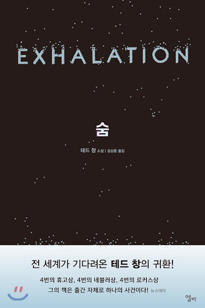

## 저자 : 테드 창 , 김상훈 옮김 / 엘리

## 읽은기간 : 20.03.24 ~ 20.03.29

## 518 pages

### 현역 최고의 SF 작가라는 테드창의 두번째 작품집 숨이다.

### 드문드문 일년에 한편쯤 내던 단편, 중편 소설들 9편을 모아놨다.

### 한 4년전 개봉했던 드뇌 뵐뇌브 감독의 컨택트라는 영화의 원작을 쓰기도 했다.

### 컴공을 졸업하고 MS의 테크니컬 라이터를 하기도 하였단다.

### 이야기들이 대부분 스펙터클하거나 기승전결이 뚜렷하진 않고,

### 철학적인 의미도 꽤나 담고 있어서

### 취향을 좀 탈것 같다는 생각은 들었다.

### 읽다보니 어릴적 읽었던 베르나르 베르베르의 작품들이 생각나기도 했다.

### (테드창 작품들은 하드 SF라 그정도로 허무맹랑 하진 않다.)

### 개인적으로는 여러 이야기 중

### 소프트웨어 객체의 생애 주기, 옴파로스, 사실적 진실 감정적 진실이 인상 깊었다.

### 소프트웨어 객체의 생애주기와 사실적진실 감정적 진실에서는

### 작가의 소프트웨어에 대한 지식 및 이해에 감탄을 하였으며,

### (사실은 전공자이기도 하고, 테크니컬 라이터까지 했을 정도면 IT 전문가라는 소리..)

### 정말 저런 미래 세상이 도래하지 않을까 하는 생각도 해보았다. 아니 꼭 올것 같다. 많이 배웠다.

### 옴파로스에서는 신이 창조한 세계관에 대한 아이디어의 신박함이 대단했다.

