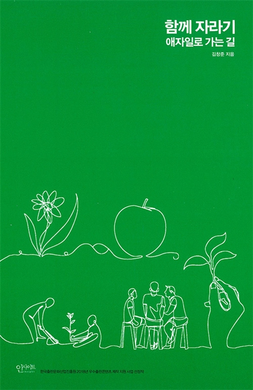

## 저자 : 김창준 / 인사이트

## 읽은기간 : 20.04.04 ~ 20.04.05

## 227 pages

### 애자일 개발 방법론에 대한 책이다.

### 책 뒷 페이지에 일단 이런 내용이 나온다.

#### 다음 문장들을 보고 거짓이라고 생각하는게 있으면 골라 보세요.

#### 1. 일반적으로 경력이 많으면 전문성도 높다.

#### 2. 수십 년간 같은 수련을 날마다 반복하면 실력이 는다.

#### 3. 실수는 최대한 예방 하는것이 좋고 그것이 가능하다.

#### 4. 업무 중 공유를 하면 신뢰가 쌓인다.

#### 5. 전문가들은 문제를 풀때 하향식 접근(문제 이해, 분석, 설계, 구현 등의 순서)을 한다.

#### 6. 전문가들로 팀을 만들면 성공률이 높아진다.

#### 7. 독립적으로 일하는 팀원들이 각자 높은 확률로 일을 마칠 수 있다고 말하면

#### 우리 팀이 일을 제대로 마칠 확률도 높다.

#### 8. 애자일로 성공하고 싶으면 작은 실천부터 시도하는 것이 좋다.

#### 9. 더 좋은 방법론을 도입하면 우리의 성공률이 올라 갈 것이다.

### 주로 위의 질문들에 대한 답을 알려주는 내용들로

### 각 장들이 구성이 되어있다.

### 이런 종류의 책은 읽다보면,

### 개인적으로 밑도 끝도없는 프랙티스를 해보자고 할때가 느껴질때가 있다.

### 처음에는 이런 책으로 생각하고, 불편하게 읽기 시작했다.

### 그러나 이책은 팀으로써의 애자일 프랙티스에 대한 내용이라기보다는,

### 개인적인 활동과 마인드 적인 측면을 강조하고 있다.

### 인상적이었던 부분은

### 1. 의도적인 수련의 중요성과 방법

### 2. 소프트웨어 관리자의 개선 우선순위

### : 실제로는 도구 - 사람 - 시스템 - 관리 순으로 중요도를 두고 개선하려 하지만

###  사실은 관리 - 시스템 - 사람 - 도구 순으로 개선을 해야 프로젝트 상황이 좋아 진다.

### 3. 멘토링을 하게 될경우, 나의 멘토에게서 각종 노하우를 최대한 뽑아내는 방법 등

### : 자기가 어떻게 잘하게 되었는지, 설명하지 못하는 멘토들이 많다.

### 본인의 경험이 아닌, 어느 책에서 읽었던 내용을 노하우랍시고 알려주는 경우도 많다.

### 그럴때는 실제 본인의 경험을 자세하게 물어보며 어떤식으로 능력을 습득했는지 관찰해야 한다.

### 예: 가장 최근 배운 언어에 대해 물어보고, 어떤 과정으로 배우고 그때 어떤 생각을 했었는지 등을 물어봄

### 4. 훌륭한 개발자는 무엇을 잘해야 하는지, 전통적으로는 개발 실력을 중시했었는데

### 최근에는 스프트스킬 즉,  커뮤니케이션 and 협업 능력, 즉 사회성을 굉장히 중시한다.

### 혼자서만 잘하는 개발자보다는 협업능력이 뛰어난 개발자가 생산성이 더 높다.

### 5. 애자일 방법론에서 가장 효과적인 부분은 고객 참여 이다.

### 고객의 범위는 각종 프로젝트 이해 당사자들 까지 포함 시키는것을 지향한다.

### 등 이었다.

### 저자가 국내 애자일 컨설팅 부분에서 경험이 많고 여러 활동들은 통하여, 명성이 쌓여있는 인물인데

### 그에 걸맞는 내공, 폭넓은 깨달음과 노하우들이 책에 담겨 있어 좋았다.

