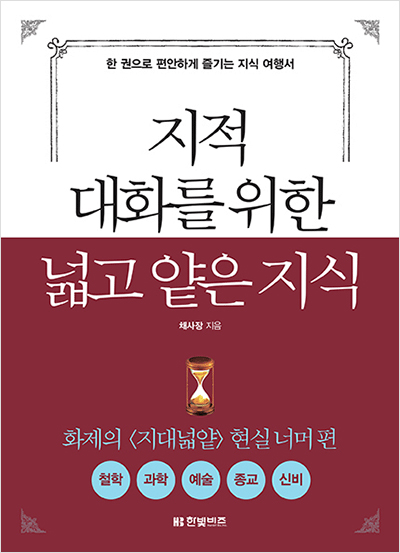

## 저자 : 채사장 / 한빛비즈

## 읽은기간 : 20.04.12 ~ 20.04.14

## 372 pages

### 출산 때문에 산부인과에서 와이프와 입원하면서 읽었던 책 2

### (대부분 서양쪽의) 철학, 과학, 예술, 종교, 신비에 대해 이야기 한다.

### 각 챕터에서 설명하는 내용들을 절대주의, 상대주의, 회의주의라는 세가지 중심개념으로

### 구분지어 설명을 하는데, 이해하기가 편해서 좋았다.

### 사람들이 지대넓얕2는 1보다 별로라고들 하는데,

### 개인적으로는 그렇지 않았다.

### 재독 할 가치가 있다고 생각한다.

### 나중에 다시 읽어야겠다.
