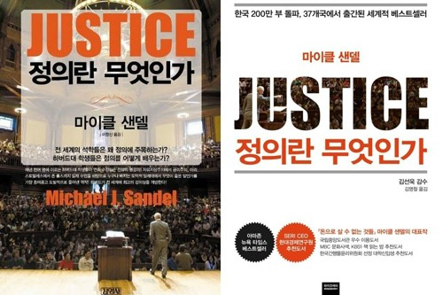

## 저자 : 마이클 샌델 , 와이즈 베리

## 읽은기간 : 20.04.16 ~ 20.04.20

## 440 pages

### 출산 때문에 산부인과+조리원에서 읽었던 책 3

### 재독

### 역사적인 4.15 총선 직후,

### 때가 된것 같아 다시 읽었다.

### 지난번보다 집중력있게 읽은것 같다.

### 벤담, 밀의 공리주의,

### 동기를 중시하는 칸트,

### 평등을 중시하는 존 롤스,

### 목적을 중시하는 아리스토 텔레스에 대한 이야기가 나오고

### 마지막에 저자의 의견을 펼친다.

### "공동선을 추구하는 공동체주의"

### 책을 보다보면

### 서양 사람들에게 있어서는

### 보편적인 생각인

### 자유주의에 대한 부분이 자주 나오는데,

### (너무 이분법인것 같긴 하지만)

### 동양쪽 사람들의 생각과는 역시 많이 다른것 같다.

### 지금 겪고 있는 코로나 사태에서도 그렇고,

### 통제없이 자유만 추구 하는 것이 정의일까?.

