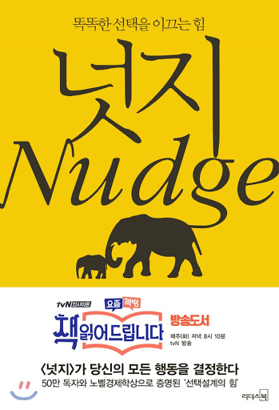

## 저자 : 리처드 H. 탈러, 캐스 R. 선스타인 저,최정규 해제,안진환 역  / 리더스 북

## 읽은기간 : 20.04.23 ~ 20.04.25

## 426 pages

### 출산 때문에 조리원에서 읽었던 책 4

### 팔꿈치로 꾸욱 찌르다라는 뜻의 "넛지"

### 사람들의 팔을 잡아 끄는게 아닌, 팔꿈치로 꾸욱 찌르는 듯이

### 바람직한 방향으로 부드럽게 유도 하되

### 선택의 자유가 개인에게 열려있는 상태를 말한다.

### 선택 설계를 잘하면 사람들을 좋은 방향으로 이끌수 있다는게 요점이다.

### 여기서도 자유주의에 대한 이야기들이 상당히 많이 나온다.

### (주로 넛지를 경계하고 반대하는 주장들)

### 책의 첫부분에서 말해주는 넛지가 무엇인지만 봐도 될것 같다는 생각이 든다.

### 나머지는 실제 사례를 들어 어떻게 사람들에게 넛지를 제공해야 하는지에 대한 부분인데,

### 미국의 의료제도, 복지제도, 조세제도, 급여제도 등에 대한 자세한 설명이 너무 많아서

### 그 부분들은 사실 관심도 그닥 없고, 잘 와닿지는 않았다.

### 다수의 사람들이 이용하는

### 정책들을 정해야 하는 높으신 공무원들이나 정치인들,

### 혹은 그들의 조직에서 일하는 실무자들이 읽어보면 좋을것 같다는 생각이 많이 들었다.

### 앱 개발자, 기획이나 UX쪽 관련자들도,

### 넛지에 대해 잘 이해하고 있으면 좋을듯
