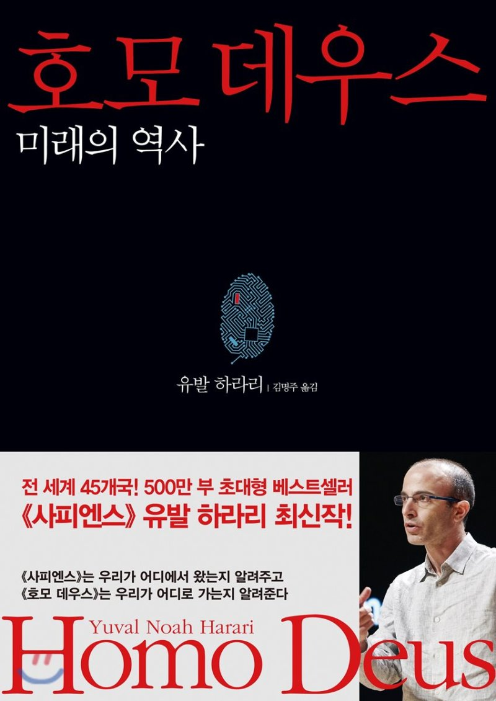

## 저자 : 유발 하라리 / 김영사

## 읽은기간 : 20. 04. 29 ~ 20. 05. 23

## 550 pages

### 이책은 저자의 전작인

### 사피엔스에서 이어지는 내용이다.

### 여기서는 인류의 미래를 예측한다.

### 미래에는 과학의 발달로,

### 기존의 정치, 종교, 철학, 사회의 개념이

### 완전히 달라질 것으로 본다.

### 저자는 특히 20세기를 지배했던 사상인,

### 인본 주의가 폐기될것으로 본다.

### 또한 인간은 영생을 추구하고 이를 실현하여

### 호모 사피엔스인 인간이

### 신인류(호모 데우스)가 될것이라고 예측한다.

### 그러나 부유 하지 못한 사람들은 신인류가 되지 못하고,

### 인권의 개념이 달라져 있으므로,

### 사회에서 쓸모없는 존재로 전락하고 말것이라 한다.

### 미래에는 새로운 계층이 생기고,

### 새로운 고통이 시작되는 것이다.

### 추가로 인상 깊었던 부분들을 간략히 적는다.

### 1. 인간의 자유의지

### 사실 자아도 없고, 자유 의지란것도 없다.

### 자아라고 여기는것도 알고보면 단일한 어떤 존재가 아니다.

### 내가 만약 어떠한 결정을 한다는것은,

### 서로 충돌하는 내적 실체들사이의 줄다리기 끝에 나오는 것이다.

### 또한 신성한 나라는 자아는 존재 하지 않는다.

### 다른 생물과 똑같다.

### 우리가 자아라고 생각하는 것, 그리고 자유의지라 생각하는것들은

### 단지 생존을 위한 알고리즘일 뿐이다.

### 2. 비 의식적인 인공지능

### 높은 지능과 발달한 의식을 같은 개념으로 혼동 하는데

### 높은 지능을 가졌지만 비 의식적인 인공지능이 나올것으로 본다.

### 3. 미래의 종교가 될 데이터교

### 약간 논리의 비약이 보이는것

### 같은 느낌이 있었지만,

### 아주 허무맹랑해보이지는 않았다.

### 어쨌거나 저자도 말하지만,

### 이책은 예언서가 아니라 하나의 가능성을 이야기 하는것 일뿐이므로..

### 호모 데우스를 끝으로 작년부터

### 목표로 했던 유발 하라리의 3대장 완독.

### 마무리 해서 기쁘다.

